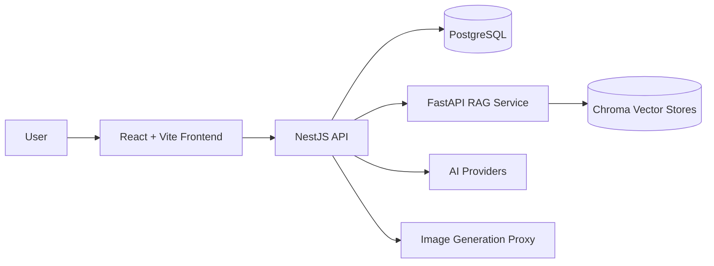

# RightNow

> An AI fitness coach, ideal-body engine, and personal evolution dashboard built for people who want to start changing right now.

English · [中文](./README.md)


RightNow is more than a workout tracker. It connects AI coaching, a RAG-powered fitness knowledge base, food logging, tasks, evolution stages, and ideal-body visuals into one product loop: what to do next, why it matters, and who the user is becoming.

## Why It Stands Out

- **AI Coach**: Generates first-day plans, follow-up guidance, and progress feedback from user goals, frequency, profile, and history.
- **Ideal-Body Engine**: Persists user photos, face references, and ideal-body images so visual progress can survive domain and device changes.
- **Fitness RAG**: A standalone FastAPI service using LangChain, Chroma, and Chinese embedding models for training and nutrition retrieval.
- **Training + Diet Loop**: Plans, TODOs, diet logs, insights, and evolution stages live in one connected experience.
- **Deployable Full Stack**: React/Vite frontend, NestJS/Prisma backend, PostgreSQL, RAG service, Nginx, and Docker Compose.
- **Public-Repo Hygiene**: Production hosts, API keys, passwords, certificates, logs, backups, and user uploads are intentionally excluded from Git.

## Tech Stack

| Layer | Stack |
| --- | --- |
| Frontend | React 19, Vite, TypeScript, Tailwind CSS, Three.js, Recharts |
| Backend | NestJS 10, Prisma, PostgreSQL, JWT, Multer |
| AI | StepFun / Gemini-compatible text flows, OpenAI-compatible image proxy |
| RAG | Python, FastAPI, LangChain, Chroma, BAAI/bge-small-zh-v1.5 |
| Deployment | Docker, Docker Compose, Nginx |

## Architecture



## Repository Layout

```text
.
├── frontend/              # User-facing web app
├── backend/               # NestJS API + Prisma schema
├── rag-service/           # FastAPI RAG service
├── docker-compose.prod.yml
├── Dockerfile.backend
├── Dockerfile.frontend
├── Dockerfile.rag
└── nginx.conf
```

## Quick Start

```bash
git clone https://github.com/BeAChanger/RightNow-3.2.git
cd RightNow-3.2
npm install
```

Prepare backend environment variables:

```bash
cp backend/.env.example backend/.env
```

Replace placeholders in `backend/.env` with private local values, then start the local database and sync the Prisma schema:

```bash
npm run db:up
npm run db:push
```

Start the backend and frontend:

```bash
npm run dev:backend
npm run dev:frontend
```

The frontend usually runs at `http://localhost:5173`, and the backend API runs at `http://localhost:5000`.

## RAG Service

```bash
cd rag-service
python -m venv .venv
source .venv/bin/activate
pip install -r requirements.txt
python -m uvicorn main:app --host 0.0.0.0 --port 8000
```

On Windows PowerShell:

```powershell
cd rag-service
python -m venv .venv
.\.venv\Scripts\Activate.ps1
pip install -r requirements.txt
python -m uvicorn main:app --host 0.0.0.0 --port 8000
```

## Docker Deployment Template

Copy the root environment template:

```bash
cp .env.example .env
```

Fill in private values, then start the stack:

```bash
docker compose -f docker-compose.prod.yml up -d --build
```

Important private variables include:

- `DATABASE_URL`
- `POSTGRES_PASSWORD`
- `JWT_SECRET`
- `ADMIN_SEED_PASSWORD`
- `STEPFUN_API_KEY`
- `IMAGE_GEN_API_KEY`
- `CORS_ORIGIN`

## Security

- Do not commit `.env` files, certificates, databases, vector stores, backups, logs, uploads, or private handoff notes.
- Do not bake AI provider keys into browser bundles. Production deployments should proxy paid model calls through the backend.
- If a secret ever reached Git history, rotate it immediately and clean history where appropriate.
- `docker-compose.prod.yml` is a public template and does not contain production hosts or real credentials.

## Roadmap

- [ ] RightNow Agent API: allow external agents to safely read plans, TODOs, training state, and coach guidance.
- [ ] Proactive contact: trigger gentle recovery prompts from missed workouts, diet gaps, and evolution goals.
- [ ] RAG quality panel: show retrieval sources, hit quality, and knowledge-base health.
- [ ] Multi-surface experience: extend the dashboard loop to IM, CLI, and mobile surfaces.

## Contributing

Issues, product discussions, and code improvements are welcome. Before submitting changes, run:

```bash
npm run build:backend
npm run build:frontend
```

Also run a sensitive-data scan to make sure no real API key, server address, password, or private user data is included.

## License

No open-source license has been declared yet. Confirm authorization with the maintainers before using, redistributing, or commercializing this project.
