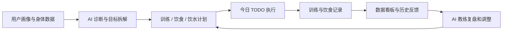
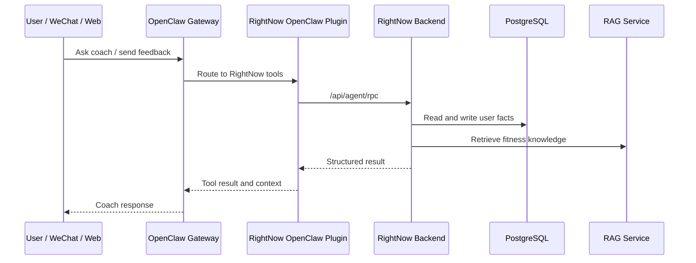
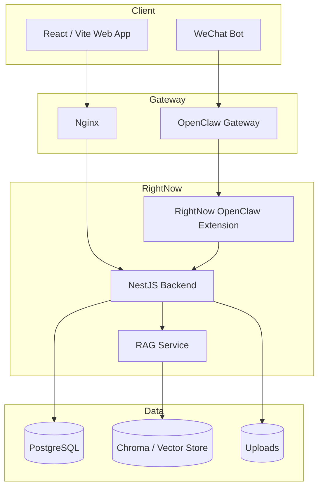

# RightNow 3.2

<p align="center">
  <strong>AI 私教，不止聊天。把评估、计划、执行、记录和复盘串成一个可持续的健身闭环。</strong>
</p>

<p align="center">
  <a href="https://github.com/BeAChanger/RightNow-3.2"></a>
  <a href="https://github.com/openclaw/openclaw"></a>
  
  
  
</p>

RightNow 是一个面向真实执行的 AI 私人健身教练系统。它不是一个单纯的健身记录工具，也不是只会回答问题的聊天机器人，而是把用户画像、身体数据、理想体型、训练计划、饮食记录、饮水计划、今日 TODO、知识库检索和微信 Bot 连接成一套可运行的产品闭环。

当前版本已经进入 **RightNow x OpenClaw** 架构：

- **RightNow** 负责用户体验、结构化业务数据、计划生成、看板和执行记录。
- **OpenClaw** 负责多通道 Agent 运行时、会话、记忆、工具调用和插件能力。
- **RAG 知识库** 负责健身、营养、训练理论和 FAQ 的专业检索。

> Product idea: believing is seeing. 先让用户看到理想状态，再把每天该做什么变成可执行、可追踪、可调整的任务。

## Table of Contents

- [Why RightNow](#why-rightnow)
- [Product Loop](#product-loop)
- [Highlights](#highlights)
- [OpenClaw Integration](#openclaw-integration)
- [Architecture](#architecture)
- [Repository Layout](#repository-layout)
- [Quick Start](#quick-start)
- [Environment](#environment)
- [Security Notes](#security-notes)
- [Roadmap](#roadmap)

## Why RightNow

大多数健身 App 只解决其中一小段问题：

- 记录体重，但不会帮你调整训练。
- 给一份训练计划，但不会知道你今天有没有做。
- 能和 AI 聊天，但 AI 读不到你的真实执行数据。
- 有饮食和训练表格，但没有一个持续理解你的教练。

RightNow 的目标是让 AI 私教进入完整工作流：



这意味着 AI 不是只给建议，而是能围绕真实数据持续工作：生成计划、解释原因、写入任务、读取历史、根据反馈调整下一步。

## Product Loop

### 1. 新用户上手

1. 注册 / 登录
2. 填写性别、年龄、身高、体重和目标
3. 上传当前照片
4. 生成理想身材图
5. 进入 AI 私教沟通
6. 完成深度问卷
7. 生成首版私教方案
8. 用户确认或提出修改
9. 计划进入今日 TODO 和数据看板

### 2. 每日执行

- 今日训练动作进入 TODO。
- 用户完成动作后，TODO 可同步到训练历史。
- 饮食、饮水、体重和训练记录进入看板。
- AI 教练可以读取这些事实，并根据用户反馈调整计划。

### 3. 多通道陪伴

用户可以在 Web 端完成建档、计划确认和看板查看，也可以通过微信 Bot 继续和同一个 AI 教练沟通。Web 与微信共用同一套用户数据和 Agent 上下文。

## Highlights

- **AI 私教方案卡**  
  基于身体数据、训练频率、饮食环境、目标周期和用户偏好生成结构化计划。

- **可编辑训练计划**  
  支持修改训练分化、动作、重量、组数、次数和目标肌群，不把 AI 输出当成不可改的静态文本。

- **TODO 执行闭环**  
  每个训练动作可以进入今日 TODO，完成后同步训练历史，避免计划和执行记录断开。

- **饮食与饮水计划**  
  生成每日热量、宏量营养、饮水量和执行目标，并同步到看板。

- **理想身材图生成**  
  用用户当前形象和目标提示词生成理想图，让目标更具象。

- **OpenClaw Agent 工具调用**  
  AI 教练可以通过工具读取用户档案、训练、饮食、TODO、知识库，也可以写入记录和任务。

- **Web + 微信 Bot 同脑**  
  微信绑定后，Bot 可以识别同一个用户，继续同一套教练上下文和数据流。

- **多层 RAG 知识库**  
  FAQ、核心理论、书籍资料分层检索，让教练回复既能直接行动，也有专业依据。

## OpenClaw Integration

OpenClaw 的定位是个人 AI 助手运行时：多通道、会话、工具、记忆和 Agent 路由都由它负责。RightNow 在这个基础上提供健身私教领域的业务能力。

RightNow 暴露给 OpenClaw 的工具包括：

- 读取用户完整上下文
- 查询今日训练、饮食、饮水和 TODO
- 创建、修改或完成 TODO
- 写入饮食记录
- 开始、更新和完成训练会话
- 查询训练历史和同肌群历史
- 检索 FAQ、核心理论和书籍知识库
- 根据用户反馈调整方案卡

典型调用链路：



## Architecture



### Frontend

- React 19
- Vite
- TypeScript
- Tailwind-style utility classes
- Axios API client
- Three.js / React Three Fiber
- Recharts

### Backend

- NestJS 10
- Prisma
- PostgreSQL
- JWT auth
- Multer / static uploads
- OpenAI-compatible model calls
- OpenClaw Gateway client

### AI / Agent

- OpenClaw Gateway
- Per-user Agent routing
- Tool calling
- Memory and session persistence
- Plugin hooks
- Agent audit logs

### RAG

- Python service
- Chroma/vector persistence
- FAQ / core theory / books multi-layer retrieval
- Knowledge import and cleanup scripts

### WeChat Bridge

- Node.js
- Tencent iLink Bot API
- Internal token protected backend calls
- Shared user binding with Web account

## Repository Layout

```text
.
├── frontend/                 React/Vite Web app
├── backend/                  NestJS API, Prisma schema, auth and business modules
├── rag-service/              Fitness knowledge retrieval service
├── wechat-bridge/            WeChat iLink bridge
├── openclaw/extensions/      RightNow OpenClaw plugin
├── docs/                     Architecture notes and implementation reports
├── docker-compose.prod.yml   Production compose template
├── nginx.conf                SPA/API proxy template
├── Dockerfile.backend
├── Dockerfile.frontend
└── Dockerfile.rag
```

## Quick Start

### Prerequisites

- Node.js 22+
- npm
- Docker and Docker Compose
- PostgreSQL, usually started through the local compose file
- Python 3.10+ for the RAG service
- OpenClaw Gateway if you want the Agent/WeChat flow

### Install

```bash
npm install
```

### Configure environment

```bash
cp .env.example .env
cp backend/.env.example backend/.env
```

Fill in database, JWT, model, OpenClaw, upload and internal service tokens according to your local setup.

### Start database

```bash
npm run db:up
npm run db:init
```

### Start development services

```bash
npm run dev:backend
npm run dev:frontend
```

Optional RAG service:

```bash
npm run dev:rag
```

Build commands:

```bash
npm run build:backend
npm run build:frontend
```

## Environment

Real runtime values are intentionally not committed. Keep these private:

- `.env` and `.env.*`
- API keys and model credentials
- database passwords
- OpenClaw Gateway tokens
- internal service tokens
- TLS certificates
- upload files
- WeChat login state
- vector database volumes
- database dumps

Production deployment should provide private values through `.env`, Docker volumes, secret management, or a separate provisioning process.

## Security Notes

- Browser clients should only talk to RightNow backend APIs.
- OpenClaw Gateway tokens must stay server-side.
- Agent tool calls go through `/api/agent/rpc` and require `AGENT_SERVICE_TOKEN`.
- User-facing Web auth uses JWT.
- WeChat bridge internal calls use `INTERNAL_API_TOKEN`.
- WeChat and OpenClaw channel senders should be treated as untrusted input until bound or authorized.
- Production server IPs, domains, certificates and real API keys should never be committed.

## Roadmap

- Stronger plan editing from AI conversation
- More reliable TODO-to-history execution sync
- Richer training-session feedback cards
- Better food-photo estimation and correction flow
- Multi-week coach memory and weekly review
- More complete OpenClaw tool coverage for app operations
- Admin/operator dashboard for debugging Agent calls

## Project Direction

RightNow 的长期方向不是“又一个健身 App”，而是一个能每天陪用户执行计划的 AI 私教系统。

它应该能理解你想改变什么，知道你今天做了什么，记住你为什么没做到，并把下一步调整成真正可执行的动作。
