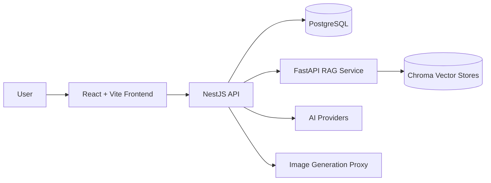

# RightNow

> AI 健身教练、理想体型引擎和个人进化仪表盘，一套为“现在就开始改变”设计的全栈应用。

[English](./README.en.md) · 中文


RightNow 不是普通的训练打卡工具。它把 AI 教练、RAG 知识库、饮食识别、任务系统、进化阶段和理想体型图像整合到一个产品里，让用户每天都能看到下一步该做什么、为什么做、以及自己正在变成什么样。

## 为什么值得关注

- **AI Coach**：根据用户画像、目标、训练频率和历史状态生成首日计划、跟进建议和阶段反馈。
- **理想体型引擎**：支持用户照片、脸部照片、理想体型图等关键视觉资产持久化，跨域名和设备恢复。
- **RAG 健身知识库**：独立 FastAPI 服务，使用 LangChain、Chroma 和中文 embedding 模型召回训练与饮食知识。
- **饮食与训练闭环**：训练计划、TODO、饮食记录、数据洞察和进化阶段在同一体验内联动。
- **全栈可部署**：React/Vite 前端、NestJS/Prisma 后端、PostgreSQL、RAG 服务和 Docker Compose 生产拓扑。
- **公开仓库安全化**：生产地址、API Key、密码、证书、日志、备份和用户上传文件均不应进入 Git。

## 技术栈

| 层级 | 技术 |
| --- | --- |
| 前端 | React 19, Vite, TypeScript, Tailwind CSS, Three.js, Recharts |
| 后端 | NestJS 10, Prisma, PostgreSQL, JWT, Multer |
| AI | StepFun / Gemini 兼容文本链路，OpenAI-compatible 图像生成代理 |
| RAG | Python, FastAPI, LangChain, Chroma, BAAI/bge-small-zh-v1.5 |
| 部署 | Docker, Docker Compose, Nginx |

## 架构



## 目录结构

```text
.
├── frontend/              # 用户端 Web App
├── backend/               # NestJS API + Prisma schema
├── rag-service/           # FastAPI RAG service
├── docker-compose.prod.yml
├── Dockerfile.backend
├── Dockerfile.frontend
├── Dockerfile.rag
└── nginx.conf
```

## 快速开始

```bash
git clone https://github.com/BeAChanger/RightNow-3.2.git
cd RightNow-3.2
npm install
```

准备后端环境变量：

```bash
cp backend/.env.example backend/.env
```

把 `backend/.env` 里的占位符替换为本地私有值，然后启动本地数据库并同步 Prisma schema：

```bash
npm run db:up
npm run db:push
```

分别启动后端和前端：

```bash
npm run dev:backend
npm run dev:frontend
```

默认前端开发地址通常是 `http://localhost:5173`，后端 API 运行在 `http://localhost:5000`。

## RAG 服务

```bash
cd rag-service
python -m venv .venv
source .venv/bin/activate
pip install -r requirements.txt
python -m uvicorn main:app --host 0.0.0.0 --port 8000
```

Windows PowerShell 可使用：

```powershell
cd rag-service
python -m venv .venv
.\.venv\Scripts\Activate.ps1
pip install -r requirements.txt
python -m uvicorn main:app --host 0.0.0.0 --port 8000
```

## Docker 部署模板

复制根目录环境变量模板：

```bash
cp .env.example .env
```

填入私有值后启动：

```bash
docker compose -f docker-compose.prod.yml up -d --build
```

必须由私有 `.env` 提供的关键变量包括：

- `DATABASE_URL`
- `POSTGRES_PASSWORD`
- `JWT_SECRET`
- `ADMIN_SEED_PASSWORD`
- `STEPFUN_API_KEY`
- `IMAGE_GEN_API_KEY`
- `CORS_ORIGIN`

## 安全说明

- 不要提交 `.env`、证书、数据库、向量库、备份、日志、上传文件或运维交接文件。
- 不要把 AI Provider Key 注入前端静态包；生产环境应优先通过后端代理访问付费模型。
- 如果任何密钥曾经进入 Git 历史，请立即轮换密钥，并按需清理历史记录。
- `docker-compose.prod.yml` 是公开模板，不包含生产地址或真实凭据。

## 路线图

- [ ] RightNow Agent API：允许外部 agent 安全读取计划、TODO、训练状态和教练建议。
- [ ] 主动触达：基于训练断档、饮食缺口和进化目标触发温和提醒。
- [ ] RAG 质量面板：展示召回来源、命中率和知识库健康状态。
- [ ] 多端体验：把 Dashboard 能力延伸到 IM、CLI 和移动端。

## 贡献

欢迎提交 issue、讨论产品方向或改进代码。提交前请至少完成：

```bash
npm run build:backend
npm run build:frontend
```

并运行敏感信息扫描，确认没有真实 API Key、服务器信息、密码或个人隐私数据进入变更。

## License

暂未声明开源许可证。使用、分发或商用前请先与项目维护者确认授权。
