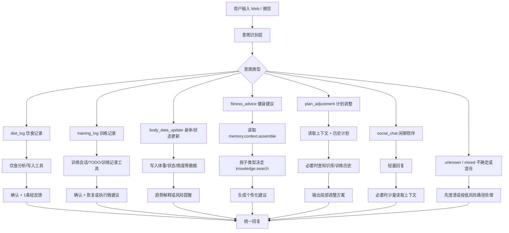
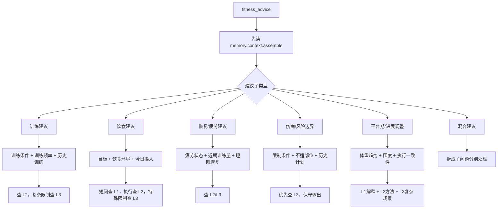

# RightNow Agent 意图分流与回复策略

这份文档用于定义 RightNow 问答助手在收到用户输入后，如何先识别意图，再决定读取哪些上下文、调用哪些工具、是否检索知识库，以及最终用什么回复形态返回给用户。

核心原则：

1. 先判断用户是在记录、分析、寻求建议、调整计划，还是闲聊。
2. 记录类优先完成写入或分析，不输出长篇方案。
3. 建议类优先读取用户上下文，再按问题类型决定是否检索知识库。
4. 风险、伤病、疲劳相关问题要更保守，优先走深度知识和安全边界。
5. 任何个性化建议都必须来自已知用户数据或用户当前明确提供的信息，不能编造记忆。

## 一、总流程



## 二、意图与处理策略总表

| 意图 | 典型用户输入 | 主动作 | 优先工具 | 是否查知识库 | 回复长度 | 是否补个性化 | 输出目标 |
| --- | --- | --- | --- | --- | --- | --- | --- |
| `diet_log` | “我中午吃了鸡胸肉和米饭” / 上传食物图 | 分析并记录饮食 | `diet.analyze.text`、`diet.analyze.image`、`diet.log.create`、`diet.gap.today` | 通常不查 | 短 | 是，最多 1 条 | 记录确认 + 饮食微反馈 |
| `training_log` | “我今天练完腿了，深蹲4组” | 更新训练记录或完成训练 | `training.session.current`、`training.session.update`、`training.session.complete`、`todo.complete` | 通常不查 | 短 | 是，最多 1 条 | 记录确认 + 恢复/执行提醒 |
| `body_data_update` | “今天体重62.8” / “膝盖有点不舒服” | 写入或标记状态变化 | 用户数据/体重/上下文工具，必要时 TODO | 只有风险问题查 L3 | 短到中 | 是 | 更新确认 + 趋势/风险边界 |
| `fitness_advice` | “减脂一周练几次” / “平台期怎么办” | 生成建议 | `memory.context.assemble`、`knowledge.search`、训练/饮食查询工具 | 是 | 中 | 是 | 个性化、可执行建议 |
| `plan_adjustment` | “把我之前的计划调轻一点” | 基于既有计划微调 | `memory.context.assemble`、训练历史、TODO、必要时知识库 | 通常查 L2/L3 | 中 | 强制 | 不推翻原计划，做局部调整 |
| `social_chat` | “今天有点没动力” | 陪伴和轻鼓励 | 可选 `memory.context.assemble` | 通常不查 | 短 | 轻度 | 稳定情绪，必要时引导下一步 |
| `unknown/mixed` | “我今天吃多了还没练，怎么办” | 拆分意图或澄清 | 先读上下文，按风险低的路径处理 | 视情况 | 中 | 是 | 先回应主要问题，再处理次要动作 |

## 三、记录类回复策略

记录类的主任务是“把事情记对”，不是展开教学。默认回复结构：

```text
确认已处理 + 当前记录的关键点 + 最多 1 条轻量个性化反馈
```

### 饮食记录

优先动作：

1. 如果是图片，先走食物图片分析。
2. 如果是文字，先走食物文字分析。
3. 如用户明确要记录，写入饮食记录。
4. 必要时读取今日饮食差距。

回复策略：

- 不输出完整饮食方案。
- 不对热量做过度确定判断。
- 如果有今日目标数据，可以轻量提醒蛋白质、总量或晚餐策略。

示例：

```text
已帮你记下这顿午饭。按你现在的减脂目标看，这顿蛋白质还不错，晚餐注意蔬菜和总量就行。
```

### 训练记录

优先动作：

1. 查当前训练会话。
2. 更新训练记录。
3. 如果用户明确说练完，完成训练会话或对应 TODO。
4. 必要时读取最近同肌群训练。

回复策略：

- 不临时生成一整套新计划。
- 可以提醒恢复、补水、拉伸或下一次训练不要急着加量。

示例：

```text
这次腿部训练已记录。今天训练量不小，晚上优先补水和休息，下一次腿部训练先看恢复感再加重量。
```

### 身体与状态更新

优先动作：

1. 记录体重、围度、疲劳、不适等状态。
2. 如果涉及疼痛、伤病、明显疲劳，标记为风险信号。
3. 必要时查 L3 安全边界知识。

回复策略：

- 体重类强调趋势，不放大单日波动。
- 疲劳/不适类优先保守，避免鼓励硬扛。

示例：

```text
体重已更新。单日波动先不用放大看，我们更看一周趋势；如果饮食和训练都稳定，后面几天的数据更有参考价值。
```

## 四、建议类内部再分流



## 五、建议类策略表

| 子类型 | 必读上下文 | 推荐知识层 | 推荐业务工具 | 回复要求 |
| --- | --- | --- | --- | --- |
| 训练建议 | 目标、训练频率、训练场景、历史训练 | L2，复杂限制补 L3 | `training.plan.today`、`training.recent.by_muscle` | 给出频率、结构、强度边界 |
| 饮食建议 | 目标、饮食环境、今日摄入、宏量差距 | L1/L2，特殊限制补 L3 | `diet.summary.today`、`diet.gap.today` | 给出食物选择和当日调整 |
| 恢复建议 | 疲劳感、近期训练密度、睡眠线索 | L2/L3 | `training.recent.by_muscle`、`todo.today.list` | 优先恢复，不鼓励硬顶 |
| 风险边界 | 伤病/不适、限制条件、当前计划 | L3 | 上下文、训练历史 | 保守建议，必要时建议线下专业判断 |
| 平台期调整 | 体重趋势、围度变化、饮食/训练执行 | L1/L2/L3 | `memory.context.assemble`、饮食/训练摘要 | 先排查，再小步调整 |
| 混合建议 | 全量上下文 | 按子问题选择 | 按子问题选择 | 分段输出，避免混乱 |

## 六、计划调整类策略

计划调整类和普通建议不同，它必须尊重用户已有方案。

默认处理顺序：

1. 读取完整上下文。
2. 找到当前训练/饮食/饮水计划。
3. 判断用户要求是降强度、换动作、改频率、改目标，还是处理限制条件。
4. 必要时查知识库。
5. 输出“保留什么、调整什么、为什么调整”。

回复结构：

```text
我会保留原计划的核心目标。
这次主要调整 A/B/C。
调整后的安排是...
这样改的原因是...
```

禁止行为：

- 不看原计划就重新生成一整套。
- 用户只是说累，就直接大幅砍掉训练。
- 伤病场景仍然鼓励冲强度。

## 七、闲聊类策略

闲聊类不需要过度工具化。

适合轻量读取上下文的情况：

- 用户明显情绪低落
- 用户提到“最近一直坚持不住”
- 用户问“你还记得我现在在干嘛吗”
- 用户把闲聊和健身状态混在一起

默认回复：

- 短
- 有陪伴感
- 不说教
- 可给一个很小的下一步

示例：

```text
今天状态低一点也没关系。你先把目标缩小到一个很小的动作，比如散步10分钟或完成一组拉伸，先把节奏接住。
```

## 八、风险与红线规则

以下情况必须进入保守模式：

1. 膝盖、腰、肩等部位疼痛或不适
2. 用户表达明显疲劳、头晕、睡眠严重不足
3. 用户处于恢复期或慢性病相关场景
4. 用户提出极端节食、极端训练、快速减重

保守模式要求：

- 不给激进训练量
- 不承诺快速效果
- 不把减脂和增肌建议说反
- 不把经验建议说成医学结论
- 必要时建议线下专业人士判断

## 九、意图识别输出格式建议

第一版可以让意图识别层输出结构化 JSON，便于后续策略执行。

```json
{
  "intent": "fitness_advice",
  "subIntent": "training_advice",
  "confidence": 0.86,
  "requiresContext": true,
  "requiresKnowledge": true,
  "requiresWriteTool": false,
  "riskLevel": "low",
  "suggestedTools": [
    "memory.context.assemble",
    "knowledge.search"
  ],
  "responseMode": "medium_advice"
}
```

字段说明：

- `intent`: 主意图
- `subIntent`: 子意图
- `confidence`: 置信度
- `requiresContext`: 是否必须读取用户上下文
- `requiresKnowledge`: 是否建议检索知识库
- `requiresWriteTool`: 是否涉及写入动作
- `riskLevel`: `low` / `medium` / `high`
- `suggestedTools`: 推荐工具调用顺序
- `responseMode`: 回复形态

## 十、回复形态定义

| responseMode | 适用场景 | 建议长度 | 结构 |
| --- | --- | --- | --- |
| `short_confirm` | 普通记录成功 | 1-2 句 | 确认 + 轻反馈 |
| `short_risk` | 不适、疲劳、伤病提示 | 2-4 句 | 确认 + 保守提醒 + 下一步 |
| `medium_advice` | 普通训练/饮食建议 | 4-8 句 | 结论 + 原因 + 执行建议 |
| `plan_adjustment` | 调整已有计划 | 中等 | 保留项 + 调整项 + 原因 |
| `clarify` | 意图不清或信息不足 | 1-3 句 | 先确认，再问一个关键问题 |
| `social_support` | 闲聊/情绪陪伴 | 1-4 句 | 共情 + 小行动 |

## 十一、第一版落地建议

第一版不用做重型 NLU 系统，可以按三层实现：

1. 规则优先：图片、数字体重、明显饮食/训练关键词先识别。
2. 模型补充：规则不确定时，让模型输出意图 JSON。
3. Agent 执行：根据意图 JSON 决定工具调用和回复形态。

推荐优先实现的 4 个意图：

1. `diet_log`
2. `training_log`
3. `fitness_advice`
4. `plan_adjustment`

等这 4 个稳定后，再扩展 `body_data_update` 和 `social_chat` 的细节策略。
