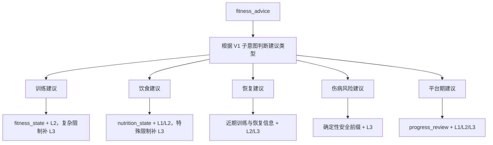

# RightNow 意图结果与回复策略

更新时间：2026-07-13

本文只定义分类完成后的产品回复策略。分类契约、V1/V2 执行顺序、安全门禁、数据库路由和回退逻辑统一见 `INTENT_CLASSIFICATION_COMPLETE_FLOW.md`。

## 1. 回复原则

1. 记录类先把事情记对，再给最多一条轻量反馈。
2. 查询类先返回 PostgreSQL 权威事实，不使用模型猜测业务数据。
3. 建议类按需读取用户上下文和 RAG，再给具体、可执行的建议。
4. 计划调整必须尊重已有计划；当前只提供建议，不直接修改计划。
5. 风险、伤病和严重疲劳场景采用保守措辞，安全前缀不依赖模型或 RAG。
6. 闲聊保持简短，不为了显得个性化而编造记忆。
7. 意图不清时只问一个关键问题，避免一次提出多项确认。

## 2. 意图与当前处理策略

| V1 意图 | 当前主要动作 | 是否读取 PostgreSQL | 是否查 RAG | 是否写业务表 | 回复目标 |
| --- | --- | --- | --- | --- | --- |
| `diet_log` | 饮食分析；明确写入时创建记录 | 是 | 通常否 | 视明确写入证据 | 热量估算 + 写入/未写入说明 |
| `training_log` | 处理训练表达；完成时创建记录 | 是 | 通常否 | 当前仅完成训练可写 | 确认训练完成和 TODO 状态 |
| `body_data_update` | 处理体重或身体状态 | 是 | 风险问题需要 | 当前仅体重可写 | 数据确认或保守风险提示 |
| `fitness_advice` | 生成训练、饮食、恢复建议 | 按需 | 是 | 否 | 个性化、可执行建议 |
| `plan_adjustment` | 基于已有计划给局部调整建议 | 按需 | 通常需要 | 当前否 | 保留项 + 调整项 + 原因 |
| `social_chat` | 陪伴、激励和轻量行动建议 | 可选 | 否 | 否 | 简短支持 |
| `unknown_mixed` | 澄清或进入普通教练聊天 | 取决于后续链路 | 取决于 V1 决策 | 否 | 回应主要问题或问一个问题 |
| `out_of_domain` | 固定拒绝 | 否 | 否 | 否 | 明确范围边界 |

八条 V2 白名单查询使用确定性模板，不经过本表中的模型回复策略。

## 3. 饮食分析与记录

### 只分析

示例输入：

```text
鸡胸肉和米饭大概多少热量？
```

回复结构：

```text
这是估算结果，可随时纠正：约 <calories> 千卡。营养数据来自常见份量估算。
```

要求：

- 不创建 `DietRecord`。
- 不显示内部 record ID。
- 不把估算描述成精确测量。

### 明确记录

示例输入：

```text
午饭吃了鸡胸肉和米饭，帮我记录。
```

回复结构：

```text
大致估算约 <calories> 千卡。已写入饮食记录，如份量不准确可以纠正。营养数据来自常见份量估算。
```

要求：

- 只有确定性规则确认写入表达时创建 `DietRecord`。
- 查询词、否定词或“只分析”表达不得触发写入。
- 写入和审计在 Backend 控制范围内完成。

## 4. 训练记录

### 完成训练

示例输入：

```text
今天训练做完了，深蹲 4 组。
```

当前动作：

- 创建 `TrainingRecord`。
- 如果当天存在未完成训练 TODO，则自动完成。
- 写入最小化工具审计。

回复应简短确认训练及 TODO 状态，并可补充一句恢复提醒。

### 训练过程更新

`training_log / update_training` 当前可以被分类，但 ChatService 尚未实现训练过程状态机写入。回复不得声称已经更新训练会话。后续需要实现幂等 start/update/complete 状态机后才能开放。

## 5. 体重与身体状态

### 体重更新

明确数字体重可以：

- 创建 `WeightRecord`。
- 更新 `User.weight`。
- 返回简短确认。

建议强调趋势，不放大单日波动。

### 疼痛、伤病和疲劳

当前不将普通疼痛或疲劳描述自动写为长期事实。回复必须：

- 建议停止可能加重不适的活动。
- 不鼓励带伤继续训练。
- 不作医学诊断。
- 持续、严重或恶化时建议专业医疗评估。
- 需要知识时优先使用 L3；RAG 失败也保留安全前缀。

## 6. 确定性查询回复

| 路由 | 回复重点 | 空状态 |
| --- | --- | --- |
| `today_plan` | 今日训练、饮食和饮水计划 | 明确说明今日暂无计划 |
| `weekly_plan` | 每个训练日的重点、动作和时长 | 明确说明本周暂无计划 |
| `today_todos` | 今日任务及完成状态 | 明确说明今日暂无任务 |
| `pending_todos` | 仅列出未完成任务 | 明确说明今天没有未完成任务 |
| `today_diet` | 项目数、总热量和各餐记录 | 明确说明今日暂无饮食记录 |
| `training_history` | 最近训练日期和描述 | 明确说明暂无训练记录 |
| `latest_weight` | 最新体重和记录日期 | 明确说明暂无体重记录 |
| `current_progress` | 计划天数、连续天数、任务完成率 | 明确说明暂无可汇总进展 |

这些回复只使用当前 JWT 用户的数据。不能因为数据为空而改用模型编造计划或历史。

## 7. 建议类分流



当前 ChatService 主要根据 V1 `requiresKnowledge` 决定是否调用 RAG。通用 `contextProfile/selectedReadSet` 尚未全部接入建议类装配，因此回复不得声称已经读取所有规划、历史表现和偏好。

建议回复通常使用：

```text
结论
  -> 关键原因
  -> 2-4 个具体执行步骤
  -> 必要的风险或限制说明
```

## 8. 计划调整

用户要求调轻、换动作或改变频率时：

1. 明确复述希望调整的部分。
2. 尽可能参考现有计划和已知限制。
3. 说明保留什么、建议调整什么以及原因。
4. 信息不足时只问一个关键澄清问题。
5. 不声称已经修改数据库计划。

推荐回复结构：

```text
我会保留原计划的核心目标。
建议调整：...
保留：...
这样调整的原因：...
```

计划写入需要独立的预览、确认、幂等和版本控制，当前尚未实现。

## 9. 闲聊和情绪支持

闲聊默认：

- 1-4 句。
- 有陪伴感但不过度承诺。
- 不说教。
- 可以给一个很小的下一步。

示例：

```text
今天状态低一点也没关系。先把目标缩小到一个很小的动作，比如散步 10 分钟或完成一组拉伸，把节奏接住就行。
```

只有用户明确引用过去偏好或持续状态时，才需要进一步核对 Memory/Profile；不能假装记得并不存在的事实。

## 10. 澄清策略

以下情况需要澄清：

- 一句话同时要求饮食和训练写入。
- 用户要求创建 TODO，但缺少日期或内容。
- 计划调整缺少要修改的计划或目标。
- 语义不清且错误执行可能产生业务副作用。

每次最多问一个关键问题。例如：

```text
你希望我先记录饮食，还是先记录训练？
```

纯只读长尾表达如果能通过 `v2-readonly` 安全映射，不需要为了分类而打断用户。

## 11. 回复红线

- 不展示内部 record ID、Token、绑定码或审计字段。
- 不把模型估算描述成精确测量。
- 不把经验建议描述成医学诊断。
- 不读取或引用其他用户的数据。
- 不在没有执行成功时声称“已记录、已修改、已创建”。
- 不在 `out_of_domain` 请求中读取用户业务上下文或调用 RAG。
- 不允许模型生成的工具名、userId 或路径决定实际执行。

## 12. 维护规则

- 分类或执行逻辑变化：更新 `INTENT_CLASSIFICATION_COMPLETE_FLOW.md`。
- 回复模板或产品表达变化：更新本文。
- 新增分类案例：更新 `AGENT_INTENT_CLASSIFIER_TESTS.csv` 和 Backend 测试。
- 实施与验证结果：更新 `development-runbook/progress.md`。
- 不再创建独立的 V1/V2 平行规范；历史阶段由 Git 和 progress 保留。
