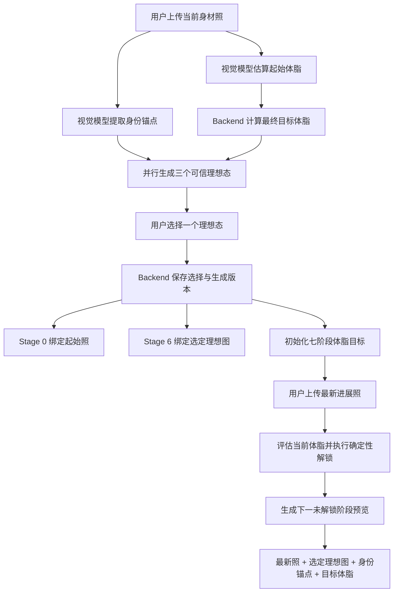

# RightNow 身材图与进化路径设计

版本：1.0
状态：本地实现与验收完成，生产发布待执行
适用范围：Web Demo 三选一、七阶段进化路径、下一阶段预览图

## 1. 目标

保留首次生成三张理想身材图的产品体验，同时让用户选中的图片成为七阶段进化路径的唯一终点参考。后续阶段图不再是孤立生成，而是在用户最新真实状态与选定理想态之间生成可信的中间状态。

本设计不改变以下事实：

- PostgreSQL 是用户档案、体脂评估、阶段状态和图片元数据的权威来源。
- 图片模型只生成视觉结果，不能决定体脂、阶段解锁或数据库写入。
- 阶段解锁继续由 Backend 的确定性规则执行。
- 三选一仅发生在首次理想态建立或用户明确重新校准时。

## 2. 完整流程



## 3. 三选一的定位

三张图表示同一个最终目标下的三种可信体型方向，而不是三种换脸或整体重构方式：

| 版本 | 目标 | 约束 |
| --- | --- | --- |
| `lean` | 自然精瘦 | 低到中等肌肉增量，强调可信减脂结果 |
| `athletic` | 运动体型 | 肌肉与体脂均衡，作为默认推荐 |
| `strong` | 强壮塑形 | 肌肉轮廓更明显，但不得生成比赛级极端状态 |

三个版本共享同一份输入照片、身份锚点、最终目标体脂、背景/服装/姿势约束，仅改变肌肉量和体型描述。现有“面部移植、维度显化、量子融合”提示词应退出正式路径，避免身份漂移和不可复现的整体重构。

## 4. 身份锚点

首次上传时提取一次结构化身份信息，后续全程复用：

```json
{
  "hair": "black short hair",
  "skinTone": "medium Asian skin tone",
  "faceShape": "round face",
  "glasses": "black framed glasses",
  "facialFeatures": "clean-shaven",
  "originalOutfit": "black t-shirt and grey shorts"
}
```

身份锚点不得包含体脂、体重、健康结论或模型推测的敏感身份。用户更换外观后可显式重新校准；普通进展上传不得覆盖现有锚点。

## 5. 权威数据模型

建议新增每用户唯一的 `EvolutionImageProfile`，或在现有进化模型中提供等价字段：

| 字段 | 含义 |
| --- | --- |
| `userId` | 当前 JWT 用户，唯一 |
| `identityAnchors` | 结构化身份锚点 JSON |
| `identityAnchorVersion` | 锚点版本，用于生成幂等 |
| `startImageUrl` | 起始真实照片 URL |
| `startBodyFat` | 起始体脂评估 |
| `targetBodyFat` | Backend 计算或教练确认的最终目标体脂 |
| `selectedIdealTaskId` | 被选中的图片任务 |
| `selectedIdealImageUrl` | 选定理想态的存储 URL |
| `selectedIdealVariant` | `lean/athletic/strong` |
| `promptVersion` | 固化提示词版本 |
| `strategyVersion` | 阶段生图策略版本 |

`ImageGenTask` 需要记录 `provider`、`model`、`promptVersion`、`inputDigest`、`variant` 和结果 URL。不得把 API Key、完整私密提示上下文或原始照片内容写入日志。

## 6. 理想态确认契约

前端点击“这就是理想的我”时调用：

```http
POST /api/evolution-stage/ideal-selection
Idempotency-Key: <client-generated-safe-key>
```

```json
{
  "imageTaskId": "image-task-id",
  "variant": "athletic"
}
```

Backend 必须验证该任务属于当前 JWT 用户、状态为完成且 variant 匹配。确认事务应：

1. 保存选定任务和理想图 URL。
2. 保存策略与提示词版本。
3. 将起始真实照片绑定到 Stage 0。
4. 将选定理想图绑定到 Stage 6。
5. 初始化或幂等更新七阶段目标。

客户端不能直接提交任意结果 URL，也不能提供 userId、目标阶段或解锁状态。

## 7. 七阶段目标

继续使用前快后慢的减速曲线：

| 阶段 | 累计进度 | 标题 |
| --- | ---: | --- |
| 0 | 0% | 当前的我 |
| 1 | 35% | 初见成效 |
| 2 | 55% | 轮廓清晰 |
| 3 | 70% | 蜕变可见 |
| 4 | 82% | 接近理想 |
| 5 | 92% | 最后冲刺 |
| 6 | 100% | 理想中的我 |

```text
阶段目标体脂 = 起始体脂 - (起始体脂 - 最终目标体脂) × 阶段进度
```

Stage 6 直接使用用户选中的理想态，不再额外调用图片模型。阶段解锁仍要求当前确定性规则，例如连续两次达标且评估间隔不少于 24 小时。

## 8. 下一阶段预览生成

生成输入按以下优先级组装：

```text
base       = 最新真实进展照
reference  = 用户选定的最终理想图
context    = 身份锚点 + 当前体脂 + 下一阶段目标体脂 + 所选体型
optional   = 起始照（供应商支持第三张输入时使用）
```

固化 Prompt 必须表达：

- 以最新照片为当前真实状态。
- 以选定理想图为最终方向，但只推进到下一阶段目标体脂。
- 只改变身体成分和与所选体型一致的有限肌肉表现。
- 保持身份、肤色、头发、服装、姿势、背景、镜头和光线。
- 不得直接生成最终状态，不得换脸或改变种族特征。

阶段预览在评估成功后异步生成，不能阻塞体脂入库或阶段判断。Stage 6 不进入该生成方法。

## 9. 幂等和重新生成

每次阶段预览计算生成指纹：

```text
SHA-256(
  latestRecordId
  + nextStageId
  + selectedIdealTaskId
  + identityAnchorVersion
  + promptVersion
  + strategyVersion
)
```

相同指纹已有成功结果时直接复用。仅在最新真实照片、目标阶段、选定理想态、身份锚点或策略版本变化时允许重新生成。并发请求必须由数据库唯一约束或事务 claim 保证只创建一个有效任务。

## 10. 存储与降级

正式环境使用对象存储或受控上传目录：

```text
供应商返回 Base64/URL
  -> Backend 校验类型和尺寸
  -> 保存到受控存储
  -> PostgreSQL 只保存 URL、hash 和生成元数据
```

不得长期把大型 Base64 写入用户资料或图片任务表。模型降级与内容降级分开执行：

```text
主图片模型
  -> Ark Seedream
  -> Legacy provider
  -> 上一次有效阶段预览
  -> 最新真实照片 + 体脂进度信息
```

图片失败不得回滚已经成功的体脂评估、进展记录或阶段解锁。

## 11. 与当前实现的差异

当前代码已经具备三选一、七阶段曲线、北极星、体脂评估、下一阶段异步预览和供应商降级。尚需完成：

- 将三套概念化 Prompt 改为三种可信体型方向。
- 持久化身份锚点和版本。
- 增加理想态确认接口与幂等键。
- 将选中理想图绑定为 Stage 6。
- 下一阶段输入从“最新照 + 起始照”调整为“最新照 + 选定理想图”，起始照作为可选补充。
- 增加生成指纹和并发幂等。
- 将大型 Base64 迁移为受控文件或对象存储 URL。
- 补全模型失败后的内容降级。

具体实施步骤和验收命令见 `development-runbook/EVOLUTION_IMAGE_IMPLEMENTATION_RUNBOOK.md`。
