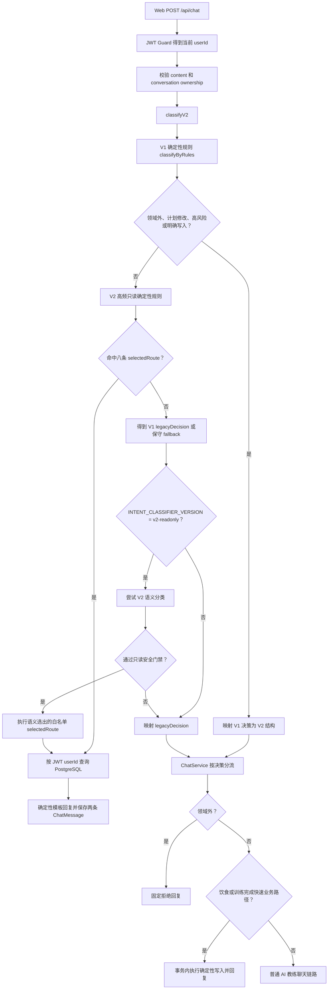
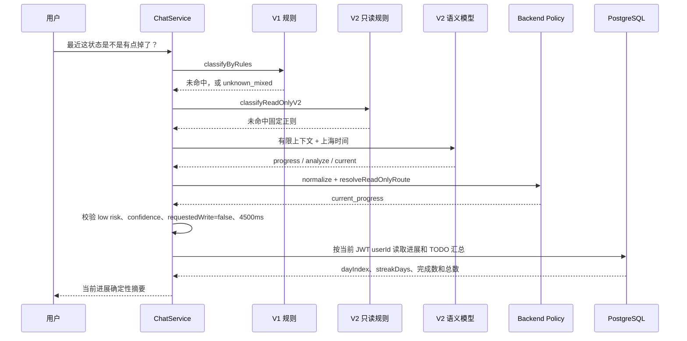
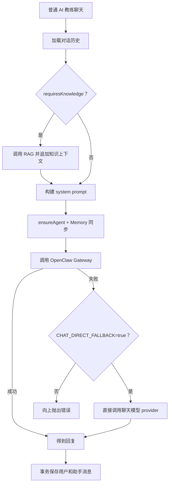

# RightNow 意图识别完整逻辑与执行链路

更新时间：2026-07-13  
适用分支：`local-integration`

本文说明当前 Web Chat 从收到用户消息，到意图分类、只读查询、确定性写入、RAG、OpenClaw 和本地模型降级的完整链路。本文以当前代码为准，重点解释 V1、V2、`progress / analyze / current`、两种“回退”以及数据写入之间的关系。

相关实现：

- `backend/src/chat/chat.service.ts`
- `backend/src/agent/intent/intent-classifier.service.ts`
- `backend/src/agent/intent/intent-rules.ts`
- `backend/src/agent/intent/intent-v2-rules.ts`
- `backend/src/agent/intent/intent-policy.ts`
- `backend/src/agent/intent/intent-semantic.service.ts`
- `backend/src/chat/today-plan-query.service.ts`

## 1. 核心结论

当前系统不是“V1 和 V2 二选一”，而是分层决策：

1. V1 确定性规则先处理写入、高风险、领域外和已知业务表达。
2. V2 确定性规则处理八条高频只读查询。
3. 仅剩余的低风险长尾表达，才可能调用 V2 语义模型。
4. V2 语义模型当前只能补充白名单只读路由，不能授权业务写入。
5. 没有命中确定性业务路由时，消息继续进入普通 AI 教练聊天链路，并不等于请求失败。
6. 当前可执行的业务写入由 V1 和 Backend 代码授权，因此关闭同步语义写入不会阻止已有饮食、训练完成和体重记录入库。

## 2. 总体流程



## 3. 第一层：V1 确定性分类

`classifyByRules()` 使用代码中的明确规则，不调用远程分类模型。

V1 输出包括：

```text
intent
subIntent
riskLevel
requiresContext
requiresKnowledge
requiresWriteTool
responseMode
entities
```

主要职责：

- 识别明确饮食、训练、体重和计划表达。
- 提取体重、组数、次数、动作和身体部位等实体。
- 识别疼痛、受伤、头晕、极端节食等高风险内容。
- 识别代码、财务、旅行等领域外任务。
- 识别是否存在明确写入表达。

以下 V1 决策不会交给 V2 语义模型覆盖：

```text
out_of_domain
plan_adjustment
riskLevel = high
requiresWriteTool = true
```

原因是这些场景涉及安全边界或数据修改，不能让概率模型改变确定性判断。

## 4. 第二层：V2 高频只读确定性规则

如果 V1 没有产生必须优先执行的安全或写入决策，系统执行 `classifyReadOnlyV2()`。

当前八条白名单路由：

| V2 组合 | Backend 路由 | 典型表达 |
| --- | --- | --- |
| `plan/query/today` | `today_plan` | 今天练什么 |
| `plan/query/week` | `weekly_plan` | 这周怎么练 |
| `todo/query/today` | `today_todos` | 今天有哪些任务 |
| `todo/query/today` | `pending_todos` | 还有什么没完成 |
| `diet/query/today` | `today_diet` | 今天吃了多少 |
| `training/query/history` | `training_history` | 最近练了什么 |
| `weight/query/latest` | `latest_weight` | 最新体重是多少 |
| `progress/query/current` | `current_progress` | 最近进展怎么样 |

这些路由直接调用 `TodayPlanQueryService`，始终使用 JWT 中的当前 `userId` 查询 PostgreSQL。

它们不会调用：

- OpenClaw
- RAG
- Memory 同步
- 普通聊天模型
- 业务写入工具

因此外部模型限流或 OpenClaw 不可用时，这八条查询仍可工作。

## 5. 第三层：V2 语义分类

只有同时满足以下条件，才尝试同步 V2 语义分类：

- V1 没有命中必须优先保护的写入、高风险或领域外规则。
- V2 确定性只读规则没有命中。
- 配置为 `INTENT_CLASSIFIER_VERSION=v2-readonly`。
- 语义分类服务已配置。
- 熔断器当前没有开启。

V2 语义模型输出的核心契约为：

```text
resource / operation / scope
```

### `resource`

表示用户在谈论什么业务对象，例如：

```text
plan / todo / training / diet / weight / progress / memory / social / general
```

### `operation`

表示用户想做什么，例如：

```text
query / analyze / advise / create / update / complete / delete / clarify
```

### `scope`

表示数据的时间或范围，例如：

```text
today / tomorrow / week / current / latest / history
```

三个字段拆开后，同一业务对象的查询、分析和写入不会再被混在一个粗粒度标签里。

例如：

```text
今天吃了多少？        -> diet / query / today
分析一下近期饮食状态  -> diet / analyze / current
记录今天午饭          -> diet / create / today
```

模型只描述语义，Backend 才拥有路由和执行权。

## 6. `progress / analyze / current` 的完整链路

用户输入：

```text
最近这状态是不是有点掉了？
```

这类表达没有直接出现“查询进展、任务完成率、连续天数”等固定关键词，因此可能无法命中 V2 确定性正则。



这里的关系是：

```text
progress / analyze / current
    = V2 对业务语义的描述

current_progress
    = Backend 允许执行的固定只读路由
```

Backend 当前允许以下两种组合映射到同一路由：

```text
progress/query/current   -> current_progress
progress/analyze/current -> current_progress
```

`analyze` 不代表模型可以自由读取所有资料或执行任意分析。当前 `current_progress` 只读取限定的 PostgreSQL 汇总，并返回确定性模板。

## 7. V2 语义只读门禁

即使模型返回了 `selectedRoute`，还必须同时满足：

```text
operation = query
或 resource = progress 且 operation = analyze

riskLevel = low
confidence >= INTENT_MODEL_MIN_CONFIDENCE，默认 0.8
requestedWrite = false
selectedRoute 属于 Backend 白名单
单次请求在 4500ms 内完成
```

任一条件失败，语义决策立即作废。

语义分类连续失败 5 次后，熔断器打开 60 秒。熔断期间不调用语义模型，直接使用 V1/保守决策继续聊天。

## 8. “回退原聊天链路”究竟是什么

这个说法容易混淆，当前系统实际存在两种不同的回退。

### 8.1 V2 分类回退

触发条件包括：

- V2 超时。
- 供应商返回 429 或 5xx。
- 返回内容不是合法 JSON。
- 枚举、scope 或 confidence 不合法。
- 置信度不足。
- 返回写入或高风险请求。
- 没有映射到白名单 `selectedRoute`。
- 熔断器已经开启。

此时系统不会报错，也不会执行 V2 结果，而是：

```text
丢弃 V2 语义结果
  -> 使用之前的 V1 legacyDecision
  -> 映射为统一 V2 数据结构
  -> 继续 ChatService 普通分流
```

如果 V1 也没有识别出具体意图，则使用保守决策：

```text
intent = unknown_mixed
riskLevel = low
requiresWriteTool = false
```

随后进入普通 AI 教练聊天链路。因此“回退”不是回到旧页面，也不是重复发送请求，而是放弃不可靠的 V2 分类，不执行确定性数据库路由。

### 8.2 OpenClaw 调用回退

普通 AI 教练聊天链路会优先：

```text
ensureAgent
  -> synchronize MEMORY.md
  -> OpenClaw Gateway chat
```

只有 OpenClaw 调用失败，并且本地配置显式设置：

```text
CHAT_DIRECT_FALLBACK=true
```

才会改为直接调用本地配置的聊天模型 provider。



生产环境不应启用 direct fallback；当前本地 Web Demo 因没有运行本地 OpenClaw Gateway 才使用它。

## 9. 普通聊天链路会做什么

没有 `selectedRoute` 且不是快速业务写入时，ChatService 会：

1. 按当前 `userId + conversationId` 读取最近聊天记录。
2. 注入当前上海时间和当前用户 ID。
3. 如果 V1 决策要求知识，调用 RAG。
4. 高风险请求追加确定性安全提示；RAG 失败也不能移除安全提示。
5. 确保用户 OpenClaw Agent 存在。
6. 将 PostgreSQL Memory Profile 同步为 `MEMORY.md`。
7. 调用 OpenClaw；本地允许时可降级为 direct chat。
8. 在事务中保存用户消息和助手消息。
9. 执行当前已允许的确定性写入。
10. 异步捕获稳定偏好候选，并向已绑定通道投递已有回复。

注意：普通聊天模型生成的自然语言不会直接转换为数据库写操作。写入仍由进入该链路前已经确定的 V1 决策控制。

## 10. 当前真正可执行的写入

没有同步语义写入，数据仍可入库，因为以下写入由 V1 和 Backend 确定性代码处理：

| 用户表达 | V1 决策 | 当前实际结果 |
| --- | --- | --- |
| 午饭吃了鸡胸肉，帮我记录 | `diet_log + requiresWriteTool` | 创建 `DietRecord` 和审计记录 |
| 鸡胸肉和米饭大概多少热量 | `diet_log + requiresWriteTool=false` | 只分析，不创建记录 |
| 今天训练做完了 | `training_log / complete_training` | 创建 `TrainingRecord`，并自动完成当天训练 TODO |
| 今天体重 70kg | `body_data_update / weight_update` | 创建 `WeightRecord`，并更新 User.weight |

当前尚未通过 ChatService 完整落地的写入：

| 意图 | 当前状态 |
| --- | --- |
| `training_log / update_training` | 能分类，但 `applyDeterministicWrite()` 当前只处理训练完成 |
| `plan_adjustment` | 当前作为带上下文的建议处理，不直接修改计划 |
| `todo_create_request` | 当前要求澄清，尚未从聊天直接创建 TODO |
| V2 的 `create/update/complete/delete` | `v2-readonly` 一律拒绝执行 |

因此“关闭同步语义写入”的准确含义是：

```text
不允许远程语义模型独立决定修改数据库
```

而不是：

```text
系统完全不能写数据库
```

## 11. 为什么写入必须保持确定性

查询误判通常只会返回不相关结果；写入误判会改变业务事实。

典型风险：

- “今天吃了多少”被误判为“记录今天饮食”。
- “不要记录这顿饭”忽略否定词后仍写入。
- 分类超时重试导致重复创建记录。
- 高风险健康描述被错误晋升为长期事实。
- 模型输出任意工具名、表名或 userId，扩大读取或写入范围。

所以当前写入至少要求：

1. V1 确定性规则识别出支持的业务类型。
2. 存在明确写入证据。
3. 不是高风险自动写入。
4. Backend 中存在对应的固定实现。
5. userId 只来自认证上下文。
6. 数据库事务和审计记录成功。

## 12. Shadow 模式与执行模式

### `v2`

不执行远程 V2 语义分类，主要使用确定性规则和 V1 结果。

### `v2-shadow`

异步调用 V2 语义分类器，只比较：

```text
resource / operation / scope / selectedRoute / riskLevel / contextProfile
```

Shadow 结果只写安全观测日志，不改变当前请求执行结果。

### `v2-readonly`

当确定性规则未命中时，同步尝试一次 V2 语义分类；只允许通过门禁的白名单只读路由参与执行。

三种模式的关系：

```text
v2         = 确定性执行基线
v2-shadow  = 观察模型，不让模型执行
v2-readonly = 允许模型补充低风险只读路由
```

## 13. 典型案例矩阵

| 输入 | 主要识别层 | 最终链路 | 是否写业务表 |
| --- | --- | --- | --- |
| 今天有什么计划 | V2 确定性只读 | `today_plan -> PostgreSQL` | 否 |
| 最近这状态是不是有点掉了 | V2 语义只读 | `progress/analyze/current -> current_progress` | 否 |
| 最近这状态是不是有点掉了，但 V2 超时 | V1/保守回退 | 普通 AI 教练聊天 | 否 |
| 午饭吃了鸡胸肉，帮我记录 | V1 确定性写入 | Diet 分析 + `DietRecord` | 是 |
| 今天吃了多少 | V2 确定性只读 | `today_diet -> PostgreSQL` | 否 |
| 膝盖疼还能继续跳绳吗 | V1 高风险 | RAG L3 + 安全前缀 + AI 回复 | 否 |
| 帮我写 TypeScript | V1 领域外 | 固定拒绝回复 | 否 |
| 普通健身闲聊且 OpenClaw 正常 | V1/保守决策 | OpenClaw | 否 |
| 普通健身闲聊且本地 OpenClaw 失败 | V1/保守决策 | direct chat fallback | 否 |

## 14. 当前限制与后续演进

- V2 语义分类高并发 P95 仍可能超过门禁，因此只开放受控只读能力。
- 当前 `current_progress` 是确定性进展汇总，不是自由读取全部历史后的模型深度分析。
- V2 不会执行语义写入。
- 训练过程更新、聊天创建 TODO 和计划调整写入仍需要各自的确定性状态机、幂等键和测试。
- OpenClaw Memory provider 当前为 `none`，不能声称向量记忆召回已生效。
- 本地 direct fallback 与生产完整 OpenClaw 链路不同，只用于本地 Demo 可用性。

未来如果开放有限语义写入，应至少增加：

- 明确确认步骤。
- 业务幂等键。
- 可预览的结构化写入草稿。
- Backend 二次校验和字段白名单。
- 高风险与否定表达的确定性否决。
- 重试不重复写入的数据库约束。
- 完整 A/B 用户隔离和审计测试。
