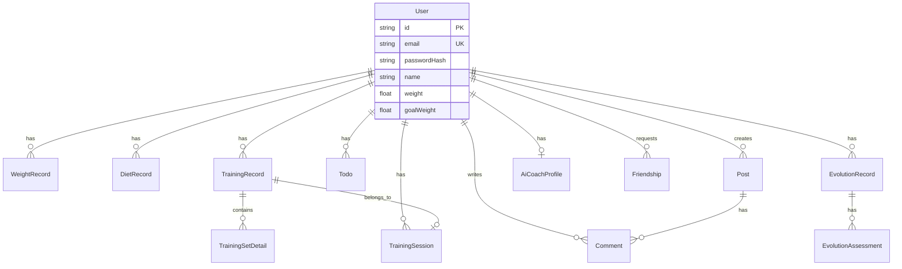

# RightNow Fitness - 寮€鍙戜氦鎺ユ枃妗?

**鏂囨。鐗堟湰**: v1.0
**鐢熸垚鏃ユ湡**: 2026-03-06
**椤圭洰鐘舵€?*: 寮€鍙戜腑锛堝熀鍑嗕唬鐮佸凡瀹屾垚锛岄儴鍒嗗姛鑳藉緟浼樺寲锛?

---

## 鐩綍

- [1. 椤圭洰姒傝](#1-椤圭洰姒傝)
- [2. 绯荤粺鏋舵瀯](#2-绯荤粺鏋舵瀯)
- [3. 鎶€鏈爤](#3-鎶€鏈爤)
- [4. 浠ｇ爜搴撶粨鏋刔(#4-浠ｇ爜搴撶粨鏋?
- [5. 鏁版嵁搴撹璁(#5-鏁版嵁搴撹璁?
- [6. API鎺ュ彛瑙勮寖](#6-api鎺ュ彛瑙勮寖)
- [7. 鏈湴寮€鍙戠幆澧冩惌寤篯(#7-鏈湴寮€鍙戠幆澧冩惌寤?
- [8. 娴嬭瘯绛栫暐](#8-娴嬭瘯绛栫暐)
- [9. 宸茬煡闂涓庢妧鏈€篯(#9-宸茬煡闂涓庢妧鏈€?
- [10. 鎵╁睍寮€鍙戞寚鍗梋(#10-鎵╁睍寮€鍙戞寚鍗?
- [11. 浜ゆ帴楠屾敹娓呭崟](#11-浜ゆ帴楠屾敹娓呭崟)

---

## 1. 椤圭洰姒傝

### 1.1 涓氬姟鐩爣

RightNow Fitness 鏄竴娆惧熀浜?AI 鐨勬櫤鑳藉仴韬簲鐢紝鎻愪緵锛?
- **涓€у寲鍋ヨ韩璁″垝**锛氭牴鎹敤鎴蜂綋鍨嬨€佺洰鏍囩敓鎴愬畾鍒惰缁冨拰楗鏂规
- **AI 鏁欑粌瀵硅瘽**锛氬疄鏃跺仴韬寚瀵笺€佸姩浣滅籂姝ｃ€佽惀鍏诲缓璁?
- **浣撳瀷杩涘寲寮曟搸**锛欰I 鐢熸垚鐩爣浣撳瀷鍥剧墖锛屽彲瑙嗗寲鍋ヨ韩杩涘害
- **绀惧尯浜掑姩**锛氭墦鍗″垎浜€佸ソ鍙嬬郴缁熴€佸姩鎬佽瘎璁?
- **鏁版嵁杩借釜**锛氫綋閲嶃€侀ギ椋熴€佽缁冭褰曠殑鍙鍖栧垎鏋?

### 1.2 鏍稿績鍔熻兘妯″潡

| 妯″潡 | 鍔熻兘鎻忚堪 | 寮€鍙戠姸鎬?|
|------|---------|---------|
| 鐢ㄦ埛璁よ瘉 | 娉ㄥ唽/鐧诲綍/JWT 閴存潈 | 鉁?宸插畬鎴?|
| 涓汉妗ｆ | 浣撳瀷鏁版嵁銆佺洰鏍囪瀹?| 鉁?宸插畬鎴?|
| AI 鏁欑粌 | 瀵硅瘽寮忓仴韬寚瀵?| 鉁?宸插畬鎴?|
| 璁粌璁板綍 | 璁粌鏃ュ織銆佺粍娆¤鎯?| 鉁?宸插畬鎴?|
| 楗绠＄悊 | 楗璁板綍銆佹媿鐓ц瘑鍒?| 鈿狅笍 瀛樺湪 Bug |
| 浣撻噸杩借釜 | 浣撻噸/鑵板洿/鑷€鍥磋褰?| 鉁?宸插畬鎴?|
| 浣撳瀷杩涘寲 | AI 鐢熷浘銆佽繘搴﹁拷韪?| 鈿狅笍 Prompt 寰呬紭鍖?|
| 绀惧尯鍔熻兘 | 鍔ㄦ€佸彂甯冦€佽瘎璁恒€佺偣璧?| 鈿狅笍 娴嬭瘯鏈畬鎴?|
| 濂藉弸绯荤粺 | 濂藉弸鐢宠銆佸叧绯荤鐞?| 鈿狅笍 娴嬭瘯鏈畬鎴?|
| RAG 鐭ヨ瘑搴?| 鍋ヨ韩鐭ヨ瘑妫€绱㈠寮?| 鈿狅笍 閾捐矾寰呬紭鍖?|

### 1.3 鎶€鏈寒鐐?

- **Monorepo 鏋舵瀯**锛氬墠鍚庣缁熶竴绠＄悊锛屽叡浜厤缃?
- **3D 鍙鍖?*锛歍hree.js 瀹炵幇浜轰綋妯″瀷灞曠ず
- **AI 椹卞姩**锛欸oogle Gemini + RAG 鎻愪緵鏅鸿兘瀵硅瘽
- **瀹炴椂鍙嶉**锛氳缁冭繃绋嬩腑鐨?AI 瀹炴椂鎸囧
- **娓愯繘寮?PWA**锛氭敮鎸佺Щ鍔ㄧ瀹夎

---

## 2. 绯荤粺鏋舵瀯

### 2.1 鏁翠綋鏋舵瀯鍥?

```mermaid
graph TB
    subgraph "鍓嶇灞?
        A[React + Vite<br/>绔彛: 5173]
        A1[3D 妯″瀷娓叉煋<br/>Three.js]
        A2[鐘舵€佺鐞?br/>React Hooks]
    end

    subgraph "鍚庣灞?
        B[NestJS API<br/>绔彛: 5000]
        B1[Auth Module<br/>JWT]
        B2[AI Coach Module]
        B3[Diet Module]
        B4[Community Module]
        B5[Training Module]
    end

    subgraph "鏁版嵁灞?
        C[PostgreSQL<br/>绔彛: 15433]
        C1[Prisma ORM]
    end

    subgraph "AI 鏈嶅姟灞?
        D[RAG Service<br/>Python FastAPI<br/>绔彛: 8000]
        D1[ChromaDB<br/>鍚戦噺鏁版嵁搴揮
        E[Google Gemini API]
    end

    A --> B
    A1 --> A
    A2 --> A
    B --> C
    B1 --> B
    B2 --> B
    B2 --> D
    B2 --> E
    B3 --> B
    B4 --> B
    B5 --> B
    C1 --> C
    D --> D1
```

### 2.2 鏁版嵁娴佸悜

#### 鐢ㄦ埛璇锋眰娴佺▼
```
鐢ㄦ埛鎿嶄綔 鈫?鍓嶇缁勪欢 鈫?Axios 璇锋眰 鈫?NestJS Controller
    鈫?Service 灞備笟鍔￠€昏緫 鈫?Prisma ORM 鈫?PostgreSQL
    鈫?杩斿洖鏁版嵁 鈫?鍓嶇娓叉煋
```

#### AI 瀵硅瘽娴佺▼
```
鐢ㄦ埛娑堟伅 鈫?AIChat.tsx 鈫?POST /ai-coach/chat
    鈫?AI Coach Service 鈫?RAG Service (鐭ヨ瘑妫€绱?
    鈫?Google Gemini API (鐢熸垚鍥炲)
    鈫?淇濆瓨瀵硅瘽鍘嗗彶 鈫?杩斿洖 AI 鍥炲
```

#### 楗璇嗗埆娴佺▼
```
鎷嶇収 鈫?ActionCenter.tsx 鈫?涓婁紶鍥剧墖 鈫?POST /upload
    鈫?鑾峰彇鍥剧墖 URL 鈫?POST /diet/recognize
    鈫?Gemini Vision API 鈫?璇嗗埆椋熺墿淇℃伅
    鈫?淇濆瓨楗璁板綍 鈫?杩斿洖缁撴瀯鍖栨暟鎹?
```

---

## 3. 鎶€鏈爤

### 3.1 鍓嶇鎶€鏈爤

| 鎶€鏈?| 鐗堟湰 | 鐢ㄩ€?|
|------|------|------|
| React | 19.2.4 | UI 妗嗘灦 |
| TypeScript | 5.8.2 | 绫诲瀷瀹夊叏 |
| Vite | 6.2.0 | 鏋勫缓宸ュ叿 |
| Three.js | 0.182.0 | 3D 娓叉煋 |
| @react-three/fiber | 9.5.0 | React Three.js 闆嗘垚 |
| @react-three/drei | 10.7.7 | Three.js 杈呭姪搴?|
| Recharts | 3.7.0 | 鏁版嵁鍥捐〃 |
| Axios | 1.13.5 | HTTP 瀹㈡埛绔?|
| Tailwind CSS | - | 鏍峰紡妗嗘灦 |

### 3.2 鍚庣鎶€鏈爤

| 鎶€鏈?| 鐗堟湰 | 鐢ㄩ€?|
|------|------|------|
| NestJS | 10.4.15 | 鍚庣妗嗘灦 |
| Prisma | 6.4.1 | ORM |
| PostgreSQL | - | 鍏崇郴鏁版嵁搴?|
| JWT | 10.2.0 | 韬唤璁よ瘉 |
| Passport | 0.7.0 | 璁よ瘉涓棿浠?|
| Bcrypt | 5.1.1 | 瀵嗙爜鍔犲瘑 |
| Multer | 1.4.5 | 鏂囦欢涓婁紶 |

### 3.3 AI 鏈嶅姟鎶€鏈爤

| 鎶€鏈?| 鐗堟湰 | 鐢ㄩ€?|
|------|------|------|
| Python | 3.x | RAG 鏈嶅姟璇█ |
| FastAPI | - | API 妗嗘灦 |
| ChromaDB | - | 鍚戦噺鏁版嵁搴?|
| Google Gemini | - | LLM 妯″瀷 |
| Uvicorn | - | ASGI 鏈嶅姟鍣?|

### 3.4 寮€鍙戝伐鍏?

- **鍖呯鐞嗗櫒**: npm (Monorepo Workspaces)
- **瀹瑰櫒鍖?*: Docker Compose (PostgreSQL)
- **鐗堟湰鎺у埗**: Git
- **浠ｇ爜瑙勮寖**: TypeScript ESLint
- **API 娴嬭瘯**: (寤鸿琛ュ厖 Postman/Insomnia 閰嶇疆)

---

## 4. 浠ｇ爜搴撶粨鏋?

### 4.1 Monorepo 鐩綍缁撴瀯

```
RightNow-Fitness/
鈹溾攢鈹€ frontend/                 # React 鍓嶇搴旂敤
鈹?  鈹溾攢鈹€ views/               # 椤甸潰缁勪欢 (24 涓鍥?
鈹?  鈹?  鈹溾攢鈹€ Splash.tsx       # 鍚姩椤?
鈹?  鈹?  鈹溾攢鈹€ Onboarding.tsx   # 寮曞椤?
鈹?  鈹?  鈹溾攢鈹€ Dashboard.tsx    # 涓婚〉 (鍚?3D 妯″瀷)
鈹?  鈹?  鈹溾攢鈹€ AIChat.tsx       # AI 瀵硅瘽
鈹?  鈹?  鈹溾攢鈹€ DietLog.tsx      # 楗璁板綍
鈹?  鈹?  鈹溾攢鈹€ Community.tsx    # 绀惧尯鍔ㄦ€?
鈹?  鈹?  鈹溾攢鈹€ EvolutionEngine.tsx  # 浣撳瀷杩涘寲
鈹?  鈹?  鈹斺攢鈹€ ...
鈹?  鈹溾攢鈹€ components/          # 鍙鐢ㄧ粍浠?
鈹?  鈹?  鈹溾攢鈹€ BottomNav.tsx    # 搴曢儴瀵艰埅
鈹?  鈹?  鈹溾攢鈹€ FloatingAdvisor.tsx  # 鎮诞 AI 鎸夐挳
鈹?  鈹?  鈹斺攢鈹€ Hero3D.tsx       # 3D 妯″瀷鏌ョ湅鍣?
鈹?  鈹溾攢鈹€ api/                 # API 瀹㈡埛绔?
鈹?  鈹?  鈹溾攢鈹€ client.ts        # Axios 瀹炰緥
鈹?  鈹?  鈹溾攢鈹€ index.ts         # API 鏂规硶姹囨€?
鈹?  鈹?  鈹斺攢鈹€ training.ts      # 璁粌鐩稿叧 API
鈹?  鈹溾攢鈹€ services/            # 涓氬姟鏈嶅姟
鈹?  鈹?  鈹斺攢鈹€ gemini.ts        # Gemini API 灏佽
鈹?  鈹溾攢鈹€ types.ts             # TypeScript 绫诲瀷瀹氫箟
鈹?  鈹溾攢鈹€ App.tsx              # 涓诲簲鐢ㄧ粍浠?
鈹?  鈹溾攢鈹€ index.tsx            # React 鍏ュ彛
鈹?  鈹溾攢鈹€ vite.config.ts       # Vite 閰嶇疆
鈹?  鈹斺攢鈹€ package.json
鈹?
鈹溾攢鈹€ backend/                 # NestJS 鍚庣 API
鈹?  鈹溾攢鈹€ src/
鈹?  鈹?  鈹溾攢鈹€ auth/            # 璁よ瘉妯″潡
鈹?  鈹?  鈹?  鈹溾攢鈹€ auth.controller.ts
鈹?  鈹?  鈹?  鈹溾攢鈹€ auth.service.ts
鈹?  鈹?  鈹?  鈹溾攢鈹€ strategies/jwt.strategy.ts
鈹?  鈹?  鈹?  鈹斺攢鈹€ guards/      # 瀹堝崼 (鏂板)
鈹?  鈹?  鈹溾攢鈹€ users/           # 鐢ㄦ埛妯″潡
鈹?  鈹?  鈹溾攢鈹€ ai-coach/        # AI 鏁欑粌妯″潡
鈹?  鈹?  鈹溾攢鈹€ diet/            # 楗妯″潡
鈹?  鈹?  鈹?  鈹溾攢鈹€ diet.controller.ts  # (鏂板)
鈹?  鈹?  鈹?  鈹溾攢鈹€ diet.service.ts     # (鏂板)
鈹?  鈹?  鈹?  鈹斺攢鈹€ diet-cleanup.service.ts
鈹?  鈹?  鈹溾攢鈹€ training/        # 璁粌妯″潡
鈹?  鈹?  鈹溾攢鈹€ training-session/  # 璁粌浼氳瘽 (鏂板)
鈹?  鈹?  鈹溾攢鈹€ evolution/       # 浣撳瀷杩涘寲妯″潡
鈹?  鈹?  鈹溾攢鈹€ evolution-stage/ # 杩涘寲闃舵 (鏂板)
鈹?  鈹?  鈹溾攢鈹€ posts/           # 绀惧尯鍔ㄦ€?
鈹?  鈹?  鈹?  鈹溾攢鈹€ posts.controller.ts  # (鏂板)
鈹?  鈹?  鈹?  鈹斺攢鈹€ posts.service.ts     # (鏂板)
鈹?  鈹?  鈹溾攢鈹€ friendships/     # 濂藉弸绯荤粺
鈹?  鈹?  鈹溾攢鈹€ chat/            # 鑱婂ぉ妯″潡
鈹?  鈹?  鈹溾攢鈹€ upload/          # 鏂囦欢涓婁紶
鈹?  鈹?  鈹?  鈹斺攢鈹€ upload.service.ts  # (鏂板)
鈹?  鈹?  鈹溾攢鈹€ prompts/         # AI Prompt 妯℃澘 (鏂板)
鈹?  鈹?  鈹溾攢鈹€ prisma/          # Prisma 鏈嶅姟
鈹?  鈹?  鈹溾攢鈹€ common/          # 鍏叡妯″潡
鈹?  鈹?  鈹?  鈹斺攢鈹€ decorators/  # 瑁呴グ鍣?
鈹?  鈹?  鈹溾攢鈹€ app.module.ts    # 鏍规ā鍧?
鈹?  鈹?  鈹斺攢鈹€ main.ts          # 搴旂敤鍏ュ彛
鈹?  鈹溾攢鈹€ prisma/
鈹?  鈹?  鈹溾攢鈹€ schema.prisma    # 鏁版嵁搴?Schema
鈹?  鈹?  鈹斺攢鈹€ seed.ts          # 绉嶅瓙鏁版嵁
鈹?  鈹溾攢鈹€ .env.example         # 鐜鍙橀噺绀轰緥
鈹?  鈹溾攢鈹€ docker-compose.yml   # PostgreSQL 瀹瑰櫒
鈹?  鈹斺攢鈹€ package.json
鈹?
鈹溾攢鈹€ rag-service/             # RAG 鐭ヨ瘑搴撴湇鍔?
鈹?  鈹溾攢鈹€ api/                 # API 璺敱
鈹?  鈹溾攢鈹€ services/            # 涓氬姟鏈嶅姟
鈹?  鈹溾攢鈹€ scripts/             # 鑴氭湰宸ュ叿
鈹?  鈹溾攢鈹€ chroma_db/           # ChromaDB 鏁版嵁鐩綍
鈹?  鈹溾攢鈹€ main.py              # FastAPI 鍏ュ彛
鈹?  鈹溾攢鈹€ config.py            # 閰嶇疆鏂囦欢
鈹?  鈹溾攢鈹€ requirements.txt     # Python 渚濊禆
鈹?  鈹斺攢鈹€ README.md
鈹?
鈹溾攢鈹€ docs/                    # 椤圭洰鏂囨。
鈹?  鈹溾攢鈹€ ARCHITECTURE.md      # 鏋舵瀯鏂囨。
鈹?  鈹溾攢鈹€ architecture/        # 鍔熻兘鏋舵瀯璁″垝
鈹?  鈹溾攢鈹€ existing/            # 鍘嗗彶鏂囨。
鈹?  鈹斺攢鈹€ README.md
鈹?
鈹溾攢鈹€ handover/                # 浜ゆ帴鏂囨。 (鏈枃妗?
鈹?  鈹溾攢鈹€ DEV_HANDOVER.md      # 寮€鍙戜氦鎺ユ枃妗?
鈹?  鈹斺攢鈹€ OPS_RUNBOOK.md       # 杩愮淮鎵嬪唽
鈹?
鈹溾攢鈹€ scripts/                 # 鍚姩鑴氭湰
鈹?  鈹溾攢鈹€ start-dev.sh         # Linux/Mac 鍚姩鑴氭湰
鈹?  鈹斺攢鈹€ start-dev.ps1        # Windows 鍚姩鑴氭湰
鈹?
鈹溾攢鈹€ package.json             # Monorepo 鏍归厤缃?
鈹斺攢鈹€ README.md                # 椤圭洰璇存槑
```

### 4.2 鍏抽敭鏂囦欢璇存槑

#### 鍓嶇鍏抽敭鏂囦欢

| 鏂囦欢璺緞 | 浣滅敤 | 閲嶈绋嬪害 |
|---------|------|---------|
| `frontend/App.tsx` | 涓诲簲鐢ㄧ粍浠讹紝璺敱鎺у埗銆佸叏灞€鐘舵€?| 猸愨瓙猸愨瓙猸?|
| `frontend/types.ts` | 鍏ㄥ眬绫诲瀷瀹氫箟 | 猸愨瓙猸愨瓙猸?|
| `frontend/api/client.ts` | Axios 瀹炰緥閰嶇疆銆佹嫤鎴櫒 | 猸愨瓙猸愨瓙猸?|
| `frontend/views/AIChat.tsx` | AI 瀵硅瘽鏍稿績閫昏緫 | 猸愨瓙猸愨瓙猸?|
| `frontend/views/Dashboard.tsx` | 涓婚〉 3D 妯″瀷灞曠ず | 猸愨瓙猸愨瓙 |
| `frontend/components/Hero3D.tsx` | 3D 妯″瀷娓叉煋缁勪欢 | 猸愨瓙猸愨瓙 |
| `frontend/vite.config.ts` | Vite 鏋勫缓閰嶇疆 | 猸愨瓙猸?|

#### 鍚庣鍏抽敭鏂囦欢

| 鏂囦欢璺緞 | 浣滅敤 | 閲嶈绋嬪害 |
|---------|------|---------|
| `backend/src/main.ts` | NestJS 搴旂敤鍏ュ彛銆丆ORS 閰嶇疆 | 猸愨瓙猸愨瓙猸?|
| `backend/src/app.module.ts` | 鏍规ā鍧椼€佷緷璧栨敞鍏ラ厤缃?| 猸愨瓙猸愨瓙猸?|
| `backend/prisma/schema.prisma` | 鏁版嵁搴?Schema 瀹氫箟 | 猸愨瓙猸愨瓙猸?|
| `backend/src/auth/auth.service.ts` | 璁よ瘉閫昏緫銆丣WT 鐢熸垚 | 猸愨瓙猸愨瓙猸?|
| `backend/src/ai-coach/ai-coach.module.ts` | AI 鏁欑粌妯″潡 (33KB 澶ф枃浠? | 猸愨瓙猸愨瓙猸?|
| `backend/src/ai/ai.service.ts` | AI 鏈嶅姟灏佽 | 猸愨瓙猸愨瓙 |
| `backend/src/prisma/prisma.service.ts` | Prisma 瀹㈡埛绔厤缃?| 猸愨瓙猸愨瓙 |

#### RAG 鏈嶅姟鍏抽敭鏂囦欢

| 鏂囦欢璺緞 | 浣滅敤 | 閲嶈绋嬪害 |
|---------|------|---------|
| `rag-service/main.py` | FastAPI 搴旂敤鍏ュ彛 | 猸愨瓙猸愨瓙猸?|
| `rag-service/config.py` | 閰嶇疆绠＄悊 | 猸愨瓙猸愨瓙 |
| `rag-service/services/` | RAG 鏍稿績鏈嶅姟 | 猸愨瓙猸愨瓙 |

---


## 5. 鏁版嵁搴撹璁?

### 5.1 ER 鍥?



### 5.2 鏍稿績鏁版嵁琛?

#### User (鐢ㄦ埛琛?
- `id`: CUID 涓婚敭
- `email`: 鍞竴閭
- `passwordHash`: Bcrypt 鍔犲瘑瀵嗙爜
- `weight`: 褰撳墠浣撻噸 (kg)
- `goalWeight`: 鐩爣浣撻噸 (kg)
- `isProfileComplete`: 妗ｆ鏄惁瀹屾暣

#### TrainingRecord (璁粌璁板綍琛?
- `id`: CUID 涓婚敭
- `userId`: 鐢ㄦ埛 ID (澶栭敭)
- `description`: 璁粌鎻忚堪
- `duration`: 鏃堕暱 (鍒嗛挓)
- `date`: 璁粌鏃ユ湡 (YYYY-MM-DD)
- `structuredData`: 缁撴瀯鍖栨暟鎹?(JSON)
- 绱㈠紩: `(userId, date)`, `(userId, targetMuscle, date)`

#### DietRecord (楗璁板綍琛?
- `id`: CUID 涓婚敭
- `userId`: 鐢ㄦ埛 ID (澶栭敭)
- `name`: 椋熺墿鍚嶇О
- `calories`: 鍗¤矾閲?
- `protein`: 铔嬬櫧璐?(g)
- `date`: 鏃ユ湡 (YYYY-MM-DD)
- 绱㈠紩: `(userId, date)`

#### Post (绀惧尯鍔ㄦ€佽〃)
- `id`: CUID 涓婚敭
- `userId`: 鐢ㄦ埛 ID (澶栭敭)
- `content`: 鍔ㄦ€佸唴瀹?
- `images`: 鍥剧墖 URL 鏁扮粍
- `likedUserIds`: 鐐硅禐鐢ㄦ埛 ID 鏁扮粍
- 绱㈠紩: `(userId, createdAt)`

### 5.3 鏁版嵁搴撴搷浣滃懡浠?

```bash
# 鍚姩 PostgreSQL 瀹瑰櫒
npm run db:up

# 鍋滄瀹瑰櫒
npm run db:down

# 鎺ㄩ€?Schema 鍒版暟鎹簱
npm run db:push

# 杩愯绉嶅瓙鏁版嵁
npm run db:seed

# 鍒濆鍖栨暟鎹簱 (push + seed)
npm run db:init
```

---

## 6. API 鎺ュ彛瑙勮寖

### 6.1 璁よ瘉鎺ュ彛

#### POST /api/auth/register
娉ㄥ唽鏂扮敤鎴?

**璇锋眰浣?*:
```json
{
  "email": "user@example.com",
  "password": "<demo-password>",
  "name": "寮犱笁"
}
```

**鍝嶅簲**:
```json
{
  "access_token": "eyJhbGciOiJIUzI1NiIsInR5cCI6IkpXVCJ9...",
  "user": {
    "id": "clxxx",
    "email": "user@example.com",
    "name": "寮犱笁"
  }
}
```

#### POST /api/auth/login
鐢ㄦ埛鐧诲綍 (璇锋眰浣撳悓娉ㄥ唽)

### 6.2 AI 鏁欑粌鎺ュ彛

#### POST /api/ai-coach/chat
AI 瀵硅瘽

**璇锋眰澶?*: `Authorization: Bearer <token>`

**璇锋眰浣?*:
```json
{
  "message": "浠婂ぉ搴旇缁冧粈涔堬紵"
}
```

**鍝嶅簲**:
```json
{
  "reply": "鏍规嵁浣犵殑璁粌璁″垝锛屼粖澶╂槸鑳搁儴璁粌鏃?..",
  "context": {}
}
```

### 6.3 璁粌鎺ュ彛

#### POST /api/training
鍒涘缓璁粌璁板綍

**璇锋眰浣?*:
```json
{
  "description": "鍗ф帹 4缁剎10娆?,
  "duration": 60,
  "date": "2026-03-06",
  "targetMuscle": "chest"
}
```

#### GET /api/training?date=2026-03-06
鑾峰彇璁粌璁板綍

### 6.4 楗鎺ュ彛

#### POST /api/diet/recognize
璇嗗埆椋熺墿 (闇€瑕?imageUrl)

#### POST /api/diet
鍒涘缓楗璁板綍

### 6.5 绀惧尯鎺ュ彛

#### GET /api/posts
鑾峰彇鍔ㄦ€佸垪琛?(鏀寔鍒嗛〉)

#### POST /api/posts
鍙戝竷鍔ㄦ€?

### 6.6 鏂囦欢涓婁紶鎺ュ彛

#### POST /api/upload
涓婁紶鏂囦欢 (multipart/form-data)

---

## 7. 鏈湴寮€鍙戠幆澧冩惌寤?

### 7.1 鍓嶇疆瑕佹眰

- Node.js >= 18.x
- npm >= 9.x
- Docker >= 20.x (PostgreSQL)
- Python >= 3.9 (RAG 鏈嶅姟)
- Git

### 7.2 蹇€熷惎鍔?

```bash
# 1. 鍏嬮殕浠撳簱
git clone <repository-url>
cd RightNow-Fitness

# 2. 瀹夎渚濊禆
npm install

# 3. 閰嶇疆鐜鍙橀噺
cp backend/.env.example backend/.env
# 缂栬緫 backend/.env 閰嶇疆鏁版嵁搴撳拰 JWT 瀵嗛挜

# 4. 鍚姩 PostgreSQL
npm run db:up

# 5. 鍒濆鍖栨暟鎹簱
npm run db:init

# 6. 鍚姩鍚庣 (鏂扮粓绔?
npm run dev:backend

# 7. 鍚姩鍓嶇 (鏂扮粓绔?
npm run dev:frontend

# 8. (鍙€? 鍚姩 RAG 鏈嶅姟
cd rag-service
pip install -r requirements.txt
cd ..
npm run dev:rag
```

### 7.3 楠岃瘉瀹夎

- 鍓嶇: http://localhost:5173
- 鍚庣: http://localhost:5000
- RAG 鏈嶅姟: http://localhost:8000/docs

娴嬭瘯璐﹀彿: `admin@example.com` / `<admin-password>`

---

## 8. 娴嬭瘯绛栫暐

### 8.1 褰撳墠娴嬭瘯鐘舵€?

| 妯″潡 | 鍗曞厓娴嬭瘯 | 闆嗘垚娴嬭瘯 | E2E 娴嬭瘯 | 鐘舵€?|
|------|---------|---------|---------|------|
| 璁よ瘉妯″潡 | 鉂?| 鉂?| 鉂?| 鏈疄鏂?|
| AI 鏁欑粌 | 鉂?| 鉂?| 鉂?| 鏈疄鏂?|
| 璁粌璁板綍 | 鉂?| 鉂?| 鉂?| 鏈疄鏂?|
| 楗绠＄悊 | 鉂?| 鉂?| 鉂?| 鏈疄鏂?|
| 绀惧尯鍔熻兘 | 鉂?| 鉂?| 鉂?| **寰呮祴璇?* |
| 濂藉弸绯荤粺 | 鉂?| 鉂?| 鉂?| **寰呮祴璇?* |

### 8.2 寤鸿娴嬭瘯妗嗘灦

**鍚庣娴嬭瘯**:
```bash
# 瀹夎 Jest
npm --workspace backend install --save-dev @nestjs/testing jest

# 娴嬭瘯鍛戒护
npm --workspace backend run test
npm --workspace backend run test:e2e
```

**鍓嶇娴嬭瘯**:
```bash
# 瀹夎 Vitest + React Testing Library
npm --workspace frontend install --save-dev vitest @testing-library/react

# 娴嬭瘯鍛戒护
npm --workspace frontend run test
```

### 8.3 鍏抽敭娴嬭瘯鍦烘櫙

**蹇呮祴鍦烘櫙**:
1. 鐢ㄦ埛娉ㄥ唽/鐧诲綍娴佺▼
2. AI 瀵硅瘽鍝嶅簲姝ｇ‘鎬?
3. 璁粌璁板綍 CRUD
4. 楗璇嗗埆鍑嗙‘鎬?
5. 绀惧尯鍔ㄦ€佸彂甯?璇勮/鐐硅禐
6. 濂藉弸鐢宠/鎺ュ彈/鎷掔粷
7. 鏂囦欢涓婁紶瀹夊叏鎬?

---

## 9. 宸茬煡闂涓庢妧鏈€?

### 9.1 楂樹紭鍏堢骇闂 (P0)

#### 馃敶 闂 1: 楗妯″潡瀛樺湪 Bug
**鎻忚堪**: 楗璁板綍鍔熻兘瀛樺湪鏈皟璇曠殑 Bug
**褰卞搷**: 鐢ㄦ埛鏃犳硶姝ｅ父璁板綍楗鏁版嵁
**浣嶇疆**: 
- `backend/src/diet/diet.service.ts`
- `frontend/views/DietLog.tsx`
**寤鸿淇**:
1. 妫€鏌?API 鍝嶅簲鏍煎紡鏄惁涓€鑷?
2. 楠岃瘉 Gemini Vision API 璋冪敤閫昏緫
3. 娣诲姞閿欒澶勭悊鍜岄噸璇曟満鍒?

#### 馃敶 闂 2: 绀惧尯鍔熻兘鏈畬鎴愭祴璇?
**鎻忚堪**: 绀惧尯鍔ㄦ€併€佽瘎璁恒€佺偣璧炲姛鑳芥湭缁忚繃瀹屾暣娴嬭瘯
**褰卞搷**: 鍙兘瀛樺湪鏁版嵁涓€鑷存€ч棶棰?
**浣嶇疆**:
- `backend/src/posts/posts.service.ts`
- `frontend/views/Community.tsx`
**寤鸿娴嬭瘯**:
1. 鍔ㄦ€佸彂甯冨悗鏄惁姝ｇ‘鏄剧ず
2. 璇勮宓屽灞傜骇鏄惁姝ｇ‘
3. 鐐硅禐鐘舵€佸悓姝ユ槸鍚﹀噯纭?
4. 鍒嗛〉鍔犺浇鏄惁姝ｅ父

#### 馃敶 闂 3: 濂藉弸绯荤粺鏈畬鎴愭祴璇?
**鎻忚堪**: 濂藉弸鐢宠銆佹帴鍙椼€佹嫆缁濇祦绋嬫湭娴嬭瘯
**褰卞搷**: 鍙兘瀵艰嚧濂藉弸鍏崇郴鐘舵€侀敊璇?
**浣嶇疆**:
- `backend/src/friendships/friendships.service.ts`
- `frontend/views/Community.tsx` (濂藉弸鍒楄〃閮ㄥ垎)
**寤鸿娴嬭瘯**:
1. 濂藉弸鐢宠鍙戦€?鎺ユ敹
2. 閲嶅鐢宠澶勭悊
3. 濂藉弸鍒犻櫎閫昏緫
4. 濂藉弸鍒楄〃鏌ヨ鎬ц兘

### 9.2 涓紭鍏堢骇闂 (P1)

#### 馃煛 闂 4: AI 鐢熷浘 Prompt 寰呬紭鍖?
**鎻忚堪**: 浣撳瀷杩涘寲鐢熷浘鐨?Prompt 璐ㄩ噺涓嶇ǔ瀹?
**褰卞搷**: 鐢熸垚鍥剧墖璐ㄩ噺涓嶄竴鑷?
**浣嶇疆**:
- `backend/src/prompts/` (Prompt 妯℃澘鐩綍)
- `backend/src/evolution/evolution.service.ts`
**浼樺寲鏂瑰悜**:
1. 澧炲姞鏇磋缁嗙殑浣撳瀷鎻忚堪
2. 娣诲姞椋庢牸涓€鑷存€х害鏉?
3. 浼樺寲璐熼潰 Prompt
4. 娣诲姞璐ㄩ噺鎺у埗鍙傛暟

#### 馃煛 闂 5: AI 鍚庣閾捐矾寰呬紭鍖?
**鎻忚堪**: AI 鏁欑粌涓?RAG 鏈嶅姟鐨勯泦鎴愰摼璺渶瑕佷紭鍖?
**褰卞搷**: 鍝嶅簲閫熷害鎱紝鐭ヨ瘑妫€绱笉鍑嗙‘
**浣嶇疆**:
- `backend/src/ai-coach/ai-coach.module.ts` (33KB 澶ф枃浠?
- `rag-service/main.py`
**浼樺寲鏂瑰悜**:
1. 瀹炵幇璇锋眰缂撳瓨鏈哄埗
2. 浼樺寲 RAG 妫€绱㈢畻娉?
3. 娣诲姞娴佸紡鍝嶅簲鏀寔
4. 鍑忓皯 AI Coach Module 鏂囦欢澶у皬 (鎷嗗垎鏈嶅姟)

### 9.3 鎶€鏈€烘竻鍗?

| 鎶€鏈€?| 浼樺厛绾?| 棰勮宸ヤ綔閲?| 璐熻矗妯″潡 |
|--------|--------|-----------|---------|
| 缂哄皯鍗曞厓娴嬭瘯 | P0 | 2 鍛?| 鍏ㄩ儴妯″潡 |
| 缂哄皯 API 鏂囨。 (Swagger) | P1 | 3 澶?| 鍚庣 |
| 鍓嶇缂哄皯閿欒杈圭晫 | P1 | 2 澶?| 鍓嶇 |
| 缂哄皯鏃ュ織绯荤粺 | P1 | 3 澶?| 鍚庣 |
| 缂哄皯鎬ц兘鐩戞帶 | P2 | 1 鍛?| 鍏ㄦ爤 |
| 3D 妯″瀷鍔犺浇浼樺寲 | P2 | 3 澶?| 鍓嶇 |
| 鏁版嵁搴撴煡璇紭鍖?| P2 | 1 鍛?| 鍚庣 |
| 鍥剧墖鍘嬬缉鍜?CDN | P2 | 3 澶?| 鍚庣/杩愮淮 |

### 9.4 瀹夊叏闅愭偅

鈿狅笍 **闇€瑕佺珛鍗冲鐞?*:
1. JWT Secret 浣跨敤榛樿鍊?(鐢熶骇鐜蹇呴』鏇存崲)
2. 鏂囦欢涓婁紶缂哄皯绫诲瀷鍜屽ぇ灏忛獙璇?
3. API 缂哄皯璇锋眰棰戠巼闄愬埗
4. 鏁忔劅淇℃伅鍙兘娉勯湶鍦ㄦ棩蹇椾腑

---

## 10. 鎵╁睍寮€鍙戞寚鍗?

### 10.1 娣诲姞鏂扮殑 API 绔偣

**鍚庣姝ラ**:
```bash
# 1. 鐢熸垚鏂版ā鍧?
cd backend
npx nest g module feature-name
npx nest g controller feature-name
npx nest g service feature-name

# 2. 鍦?app.module.ts 涓敞鍐屾ā鍧?
# 3. 瀹炵幇 Controller 鍜?Service
# 4. 娣诲姞 DTO 楠岃瘉
```

**鍓嶇姝ラ**:
```typescript
// 1. 鍦?frontend/api/ 娣诲姞 API 鏂规硶
export const getFeature = () => client.get('/api/feature-name');

// 2. 鍦ㄧ粍浠朵腑璋冪敤
const data = await getFeature();
```

### 10.2 娣诲姞鏂扮殑鏁版嵁琛?

```bash
# 1. 缂栬緫 backend/prisma/schema.prisma
model NewTable {
  id        String   @id @default(cuid())
  userId    String
  user      User     @relation(fields: [userId], references: [id])
  createdAt DateTime @default(now())
}

# 2. 鎺ㄩ€佸埌鏁版嵁搴?
npm run db:push

# 3. 鐢熸垚 Prisma Client
cd backend && npm run prisma:generate
```

### 10.3 娣诲姞鏂扮殑鍓嶇椤甸潰

```typescript
// 1. 鍦?frontend/views/ 鍒涘缓缁勪欢
// NewView.tsx
export const NewView: React.FC<Props> = ({ onBack }) => {
  return <div>New View</div>;
};

// 2. 鍦?App.tsx 娣诲姞鏋氫妇
enum View {
  // ...
  NewView,
}

// 3. 鍦?App.tsx 娣诲姞璺敱
{currentView === View.NewView && <NewView onBack={...} />}
```

### 10.4 闆嗘垚鏂扮殑 AI 鍔熻兘

```typescript
// 1. 鍦?backend/src/ai/ai.service.ts 娣诲姞鏂规硶
async generateResponse(prompt: string) {
  const response = await this.geminiClient.generate(prompt);
  return response;
}

// 2. 鍦?Controller 涓皟鐢?
@Post('generate')
async generate(@Body() dto: GenerateDto) {
  return this.aiService.generateResponse(dto.prompt);
}
```

### 10.5 缂栫爜瑙勮寖

**TypeScript**:
- 浣跨敤 `interface` 瀹氫箟 Props
- 浣跨敤 `type` 瀹氫箟鑱斿悎绫诲瀷
- 鍑芥暟鍛藉悕: `camelCase`
- 缁勪欢鍛藉悕: `PascalCase`
- 甯搁噺鍛藉悕: `UPPER_SNAKE_CASE`

**React**:
- 浣跨敤鍑芥暟缁勪欢 + Hooks
- Props 瑙ｆ瀯浼犻€?
- 浜嬩欢澶勭悊鍑芥暟浠?`handle` 寮€澶?
- 閬垮厤鍐呰仈鍑芥暟 (鎬ц兘浼樺寲)

**NestJS**:
- 浣跨敤 DTO 楠岃瘉璇锋眰
- 浣跨敤 Guards 淇濇姢璺敱
- 浣跨敤 Interceptors 澶勭悊鍝嶅簲
- 浣跨敤 Pipes 杞崲鏁版嵁

---

## 11. 浜ゆ帴楠屾敹娓呭崟

### 11.1 鐜鎼缓楠屾敹

- [ ] Node.js 鍜?npm 鐗堟湰姝ｇ‘
- [ ] Docker 姝ｅ父杩愯
- [ ] PostgreSQL 瀹瑰櫒鍚姩鎴愬姛
- [ ] 鏁版嵁搴撳垵濮嬪寲瀹屾垚 (绉嶅瓙鏁版嵁宸插鍏?
- [ ] 鍚庣鏈嶅姟鍚姩鎴愬姛 (绔彛 5000)
- [ ] 鍓嶇鏈嶅姟鍚姩鎴愬姛 (绔彛 5173)
- [ ] RAG 鏈嶅姟鍚姩鎴愬姛 (绔彛 8000)
- [ ] 娴嬭瘯璐﹀彿鍙互姝ｅ父鐧诲綍

### 11.2 鍔熻兘楠屾敹

**鏍稿績鍔熻兘**:
- [ ] 鐢ㄦ埛娉ㄥ唽/鐧诲綍姝ｅ父
- [ ] 涓汉妗ｆ濉啓瀹屾暣
- [ ] AI 鏁欑粌瀵硅瘽鍝嶅簲姝ｅ父
- [ ] 璁粌璁板綍鍒涘缓/鏌ヨ姝ｅ父
- [ ] 浣撻噸璁板綍鍒涘缓/鏌ヨ姝ｅ父
- [ ] 3D 妯″瀷姝ｅ父鏄剧ず
- [ ] 鏁版嵁鐪嬫澘鍥捐〃姝ｅ父鏄剧ず

**寰呬慨澶嶅姛鑳?*:
- [ ] 楗璁板綍鍔熻兘宸蹭慨澶嶅苟娴嬭瘯
- [ ] 绀惧尯鍔ㄦ€佸彂甯?璇勮/鐐硅禐宸叉祴璇?
- [ ] 濂藉弸鐢宠/鎺ュ彈/鎷掔粷宸叉祴璇?
- [ ] AI 鐢熷浘 Prompt 宸蹭紭鍖?
- [ ] RAG 鐭ヨ瘑搴撴绱㈠凡浼樺寲

### 11.3 浠ｇ爜鐞嗚В楠屾敹

- [ ] 鐞嗚В Monorepo 缁撴瀯
- [ ] 鐞嗚В鍓嶇璺敱鏈哄埗 (鏋氫妇 + useState)
- [ ] 鐞嗚В鍚庣妯″潡鍒掑垎
- [ ] 鐞嗚В Prisma Schema 璁捐
- [ ] 鐞嗚В JWT 璁よ瘉娴佺▼
- [ ] 鐞嗚В AI 瀵硅瘽娴佺▼
- [ ] 鐞嗚В鏂囦欢涓婁紶娴佺▼

### 11.4 鏂囨。楠屾敹

- [ ] 闃呰瀹屾湰浜ゆ帴鏂囨。
- [ ] 闃呰 `docs/ARCHITECTURE.md`
- [ ] 闃呰 `frontend/CLAUDE.md`
- [ ] 闃呰 `backend/README.md` (濡傛湁)
- [ ] 闃呰 `rag-service/README.md`

### 11.5 寮€鍙戝伐鍏烽獙鏀?

- [ ] Git 浠撳簱鍏嬮殕鎴愬姛
- [ ] IDE 閰嶇疆瀹屾垚 (鎺ㄨ崘 VS Code)
- [ ] 浠ｇ爜鏍煎紡鍖栧伐鍏烽厤缃?(Prettier/ESLint)
- [ ] 鏁版嵁搴撳鎴风閰嶇疆 (鎺ㄨ崘 DBeaver/TablePlus)
- [ ] API 娴嬭瘯宸ュ叿閰嶇疆 (鎺ㄨ崘 Postman/Insomnia)

### 11.6 闂鎺掓煡楠屾敹

- [ ] 鐭ラ亾濡備綍鏌ョ湅鍚庣鏃ュ織
- [ ] 鐭ラ亾濡備綍鏌ョ湅鏁版嵁搴撴棩蹇?
- [ ] 鐭ラ亾濡備綍閲嶅惎鏈嶅姟
- [ ] 鐭ラ亾濡備綍閲嶇疆鏁版嵁搴?
- [ ] 鐭ラ亾濡備綍璋冭瘯鍓嶇浠ｇ爜
- [ ] 鐭ラ亾濡備綍璋冭瘯鍚庣浠ｇ爜

---

## 闄勫綍

### A. 甯哥敤鍛戒护閫熸煡

```bash
# 鏁版嵁搴?
npm run db:up          # 鍚姩 PostgreSQL
npm run db:down        # 鍋滄 PostgreSQL
npm run db:init        # 鍒濆鍖栨暟鎹簱
npm run db:push        # 鎺ㄩ€?Schema
npm run db:seed        # 杩愯绉嶅瓙鏁版嵁

# 寮€鍙?
npm run dev:frontend   # 鍚姩鍓嶇
npm run dev:backend    # 鍚姩鍚庣
npm run dev:rag        # 鍚姩 RAG 鏈嶅姟

# 鏋勫缓
npm run build:frontend # 鏋勫缓鍓嶇
npm run build:backend  # 鏋勫缓鍚庣

# 瀹夎
npm install            # 瀹夎鎵€鏈変緷璧?
npm --workspace frontend install  # 瀹夎鍓嶇渚濊禆
npm --workspace backend install   # 瀹夎鍚庣渚濊禆
```

### B. 绔彛鍗犵敤

| 鏈嶅姟 | 绔彛 | 鐢ㄩ€?|
|------|------|------|
| 鍓嶇 | 5173 | React 寮€鍙戞湇鍔″櫒 |
| 鍚庣 | 5000 | NestJS API |
| RAG 鏈嶅姟 | 8000 | Python FastAPI |
| PostgreSQL | 15433 | 鏁版嵁搴?|

### C. 鐜鍙橀噺娓呭崟

**鍚庣 (backend/.env)**:
```
DATABASE_URL=postgresql://postgres:<db-password>@localhost:15433/rightnow_fitness?schema=public
JWT_SECRET=your-secret-key
PORT=5000
HOST=0.0.0.0
CORS_ORIGIN=http://localhost:5173
RAG_SERVICE_URL=http://localhost:8000
```

**鍓嶇 (frontend/.env.local)**:
```
VITE_GEMINI_API_KEY=your-gemini-api-key
```

### D. 鑱旂郴鏂瑰紡

- **鎶€鏈礋璐ｄ汉**: [寰呭～鍐橾
- **椤圭洰缁忕悊**: [寰呭～鍐橾
- **绱ф€ヨ仈绯?*: [寰呭～鍐橾

---

**鏂囨。宸蹭紭鍖栦负鐪熶汉鍥㈤槦浜ゆ帴浣跨敤锛屽彲鐩存帴鎵撳嵃/鍒嗕韩**

**PDF 瀵煎嚭寤鸿**: 浣跨敤 Markdown 杞?PDF 宸ュ叿 (濡?Pandoc, Typora, VS Code Markdown PDF 鎻掍欢)

**楠屾敹绛惧瓧妯℃澘**:
```
浜ゆ帴鏂圭瀛? ________________  鏃ユ湡: ________
鎺ユ敹鏂圭瀛? ________________  鏃ユ湡: ________
```


