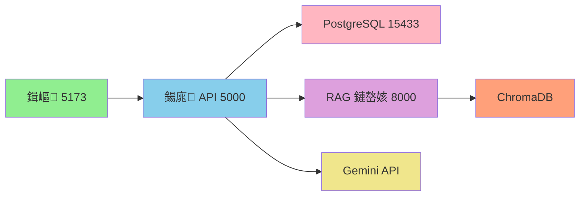
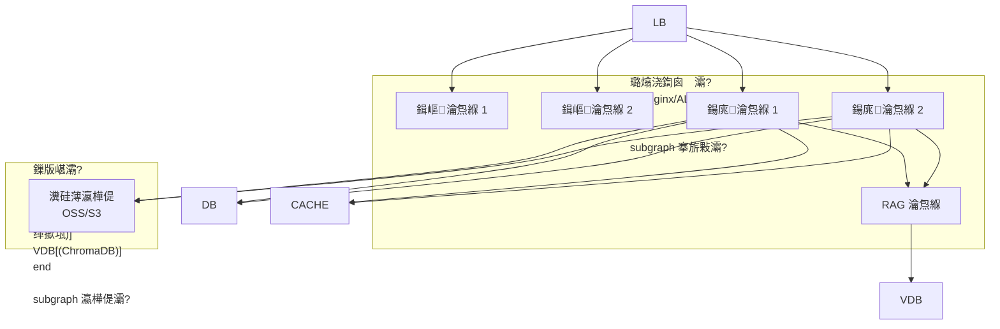

# RightNow Fitness - 杩愮淮鎵嬪唽

**鏂囨。鐗堟湰**: v1.0
**鐢熸垚鏃ユ湡**: 2026-03-06
**閫傜敤鐜**: 寮€鍙?娴嬭瘯/鐢熶骇

---

## 鐩綍

- [1. 鍩虹璁炬柦姒傝](#1-鍩虹璁炬柦姒傝)
- [2. 閮ㄧ讲鏋舵瀯](#2-閮ㄧ讲鏋舵瀯)
- [3. 閰嶇疆绠＄悊](#3-閰嶇疆绠＄悊)
- [4. 鏃ュ父杩愮淮 SOP](#4-鏃ュ父杩愮淮-sop)
- [5. 鐩戞帶涓庡憡璀(#5-鐩戞帶涓庡憡璀?
- [6. 鏁呴殰鎺掓煡鎸囧崡](#6-鏁呴殰鎺掓煡鎸囧崡)
- [7. 澶囦唤涓庢仮澶峕(#7-澶囦唤涓庢仮澶?
- [8. 瀹夊叏涓庡悎瑙刔(#8-瀹夊叏涓庡悎瑙?
- [9. 鎬ц兘浼樺寲](#9-鎬ц兘浼樺寲)
- [10. 搴旀€ュ搷搴擼(#10-搴旀€ュ搷搴?
- [11. 杩愮淮楠屾敹娓呭崟](#11-杩愮淮楠屾敹娓呭崟)

---

## 1. 鍩虹璁炬柦姒傝

### 1.1 绯荤粺缁勪欢

| 缁勪欢 | 鎶€鏈爤 | 绔彛 | 璧勬簮闇€姹?| 鐘舵€?|
|------|--------|------|---------|------|
| 鍓嶇搴旂敤 | React + Vite | 5173 | 512MB RAM | 杩愯涓?|
| 鍚庣 API | NestJS | 5000 | 1GB RAM | 杩愯涓?|
| 鏁版嵁搴?| PostgreSQL 15 | 15433 | 2GB RAM | 杩愯涓?|
| RAG 鏈嶅姟 | Python FastAPI | 8000 | 1GB RAM | 杩愯涓?|
| 鍚戦噺鏁版嵁搴?| ChromaDB | - | 512MB RAM | 杩愯涓?|

### 1.2 鏈嶅姟渚濊禆鍏崇郴



### 1.3 澶栭儴渚濊禆

- **Google Gemini API**: AI 瀵硅瘽鍜屽浘鍍忚瘑鍒?
- **鏂囦欢瀛樺偍**: 鏈湴鏂囦欢绯荤粺 (鐢熶骇鐜寤鸿浣跨敤 OSS/S3)
- **DNS**: (寰呴厤缃?
- **CDN**: (寰呴厤缃?

---

## 2. 閮ㄧ讲鏋舵瀯

### 2.1 寮€鍙戠幆澧冩嫇鎵?

```mermaid
graph TB
    subgraph "寮€鍙戞満鍣?
        A[鍓嶇 localhost:5173]
        B[鍚庣 localhost:5000]
        C[RAG localhost:8000]
    end

    subgraph "Docker 瀹瑰櫒"
        D[PostgreSQL<br/>localhost:15433]
    end

    subgraph "澶栭儴鏈嶅姟"
        E[Google Gemini API]
    end

    A --> B
    B --> D
    B --> C
    B --> E
    C --> E
```

### 2.2 鐢熶骇鐜鏋舵瀯 (寤鸿)



### 2.3 閮ㄧ讲娓呭崟

**寮€鍙戠幆澧?*:
- 鉁?Docker Compose (PostgreSQL)
- 鉁?npm scripts (鍓嶅悗绔惎鍔?
- 鈿狅笍 缂哄皯鑷姩鍖栭儴缃茶剼鏈?

**鐢熶骇鐜 (寰呭疄鏂?**:
- 鉂?CI/CD 娴佹按绾?
- 鉂?瀹瑰櫒缂栨帓 (Kubernetes/Docker Swarm)
- 鉂?璐熻浇鍧囪　鍣?
- 鉂?鏁版嵁搴撲富浠庡鍒?
- 鉂?Redis 缂撳瓨
- 鉂?瀵硅薄瀛樺偍闆嗘垚

---

## 3. 閰嶇疆绠＄悊

### 3.1 鐜鍙橀噺

#### 鍚庣鐜鍙橀噺 (backend/.env)

```bash
# 鏁版嵁搴撻厤缃?
DATABASE_URL="postgresql://postgres:<db-password>@localhost:15433/rightnow_fitness?schema=public"

# JWT 閰嶇疆
JWT_SECRET="your-secret-key-change-in-production"  # 鈿狅笍 鐢熶骇鐜蹇呴』鏇存崲

# 鏈嶅姟閰嶇疆
PORT=5000
HOST=0.0.0.0
CORS_ORIGIN="http://localhost:5173,http://localhost:5174"

# 澶栭儴鏈嶅姟
RAG_SERVICE_URL="http://localhost:8000"

# 绉嶅瓙鏁版嵁 (浠呭紑鍙戠幆澧?
ADMIN_SEED_EMAIL="admin@example.com"
ADMIN_SEED_PASSWORD="<admin-password>"
ADMIN_SEED_NAME="RightNow Admin"
```

#### 鍓嶇鐜鍙橀噺 (frontend/.env.local)

```bash
# Gemini API
VITE_GEMINI_API_KEY="your-gemini-api-key"  # 鈿狅笍 涓嶈鎻愪氦鍒?Git
```

#### RAG 鏈嶅姟閰嶇疆 (rag-service/config.py)

```python
# ChromaDB 閰嶇疆
CHROMA_DB_PATH = "./chroma_db"

# Gemini API
GEMINI_API_KEY = os.getenv("GEMINI_API_KEY")

# 鏈嶅姟閰嶇疆
HOST = "0.0.0.0"
PORT = 8000
```

### 3.2 閰嶇疆鏂囦欢浣嶇疆

| 閰嶇疆鏂囦欢 | 璺緞 | 鐢ㄩ€?|
|---------|------|------|
| 鍚庣鐜鍙橀噺 | `backend/.env` | 鏁版嵁搴撱€丣WT銆丆ORS |
| 鍓嶇鐜鍙橀噺 | `frontend/.env.local` | API 瀵嗛挜 |
| 鏁版嵁搴撻厤缃?| `backend/docker-compose.yml` | PostgreSQL 瀹瑰櫒 |
| Vite 閰嶇疆 | `frontend/vite.config.ts` | 鍓嶇鏋勫缓 |
| NestJS 閰嶇疆 | `backend/src/main.ts` | 鍚庣鍚姩 |
| Prisma 閰嶇疆 | `backend/prisma/schema.prisma` | 鏁版嵁搴?Schema |

### 3.3 Secrets 绠＄悊

鈿狅笍 **閲嶈**: 浠ヤ笅淇℃伅涓嶅緱鎻愪氦鍒扮増鏈帶鍒?
- JWT_SECRET
- GEMINI_API_KEY
- 鏁版嵁搴撳瘑鐮?
- 绗笁鏂?API 瀵嗛挜

**寤鸿鏂规**:
- 寮€鍙戠幆澧? `.env.local` (娣诲姞鍒?.gitignore)
- 鐢熶骇鐜: 浣跨敤瀵嗛挜绠＄悊鏈嶅姟 (AWS Secrets Manager, HashiCorp Vault)

---

## 4. 鏃ュ父杩愮淮 SOP

### 4.1 鏈嶅姟鍚姩娴佺▼

#### 瀹屾暣鍚姩椤哄簭

```bash
# 1. 鍚姩 PostgreSQL (蹇呴』鏈€鍏堝惎鍔?
cd /path/to/RightNow-Fitness
npm run db:up
# 绛夊緟 10 绉掔‘淇濇暟鎹簱灏辩华

# 2. 楠岃瘉鏁版嵁搴撹繛鎺?
npm run db:logs
# 鏌ョ湅鏃ュ織纭 "database system is ready to accept connections"

# 3. 鍚姩鍚庣 API (鏂扮粓绔?
npm run dev:backend
# 绛夊緟鐪嬪埌 "Nest application successfully started"

# 4. 鍚姩鍓嶇 (鏂扮粓绔?
npm run dev:frontend
# 绛夊緟鐪嬪埌 "Local: http://localhost:5173"

# 5. (鍙€? 鍚姩 RAG 鏈嶅姟 (鏂扮粓绔?
npm run dev:rag
# 绛夊緟鐪嬪埌 "Application startup complete"
```

#### 蹇€熷惎鍔?(浣跨敤鑴氭湰)

```bash
# Linux/Mac
./scripts/start-dev.sh

# Windows
.\scripts\start-dev.ps1
```

### 4.2 鏈嶅姟鍋滄娴佺▼

```bash
# 1. 鍋滄鍓嶇 (Ctrl+C)
# 2. 鍋滄鍚庣 (Ctrl+C)
# 3. 鍋滄 RAG 鏈嶅姟 (Ctrl+C)
# 4. 鍋滄 PostgreSQL
npm run db:down
```

### 4.3 鏈嶅姟閲嶅惎娴佺▼

```bash
# 閲嶅惎鍚庣 (浠ｇ爜鏇存敼鍚?
# Ctrl+C 鍋滄锛岀劧鍚庨噸鏂拌繍琛?
npm run dev:backend

# 閲嶅惎鏁版嵁搴?(閰嶇疆鏇存敼鍚?
npm run db:down
npm run db:up

# 閲嶇疆鏁版嵁搴?(娓呯┖鎵€鏈夋暟鎹?
npm run db:down
docker volume rm backend_postgres_data  # 鍒犻櫎鏁版嵁鍗?
npm run db:up
npm run db:init
```

### 4.4 鏃ュ父妫€鏌ユ竻鍗?

**姣忔棩妫€鏌?* (5 鍒嗛挓):
- [ ] 鎵€鏈夋湇鍔¤繍琛屾甯?
- [ ] 鏁版嵁搴撹繛鎺ユ甯?
- [ ] 纾佺洏绌洪棿鍏呰冻 (>20%)
- [ ] 鏃ュ織鏃犱弗閲嶉敊璇?

**姣忓懆妫€鏌?* (15 鍒嗛挓):
- [ ] 鏁版嵁搴撳浠藉畬鎴?
- [ ] 渚濊禆鍖呮棤瀹夊叏婕忔礊 (`npm audit`)
- [ ] 鏃ュ織鏂囦欢娓呯悊
- [ ] 鎬ц兘鎸囨爣姝ｅ父

**姣忔湀妫€鏌?* (30 鍒嗛挓):
- [ ] 绯荤粺鏇存柊
- [ ] 鏁版嵁搴撲紭鍖?(VACUUM, ANALYZE)
- [ ] 澶囦唤鎭㈠婕旂粌
- [ ] 瀹归噺瑙勫垝璇勪及

---

## 5. 鐩戞帶涓庡憡璀?

### 5.1 鐩戞帶鎸囨爣

#### 搴旂敤灞傛寚鏍?

| 鎸囨爣 | 姝ｅ父鑼冨洿 | 鍛婅闃堝€?| 鐩戞帶鏂瑰紡 |
|------|---------|---------|---------|
| API 鍝嶅簲鏃堕棿 | <500ms | >2s | 鈿狅笍 寰呭疄鏂?|
| API 閿欒鐜?| <1% | >5% | 鈿狅笍 寰呭疄鏂?|
| 骞跺彂鐢ㄦ埛鏁?| - | - | 鈿狅笍 寰呭疄鏂?|
| AI 鍝嶅簲鏃堕棿 | <3s | >10s | 鈿狅笍 寰呭疄鏂?|

#### 绯荤粺灞傛寚鏍?

| 鎸囨爣 | 姝ｅ父鑼冨洿 | 鍛婅闃堝€?| 鐩戞帶鏂瑰紡 |
|------|---------|---------|---------|
| CPU 浣跨敤鐜?| <70% | >90% | 鈿狅笍 寰呭疄鏂?|
| 鍐呭瓨浣跨敤鐜?| <80% | >95% | 鈿狅笍 寰呭疄鏂?|
| 纾佺洏浣跨敤鐜?| <80% | >90% | 鈿狅笍 寰呭疄鏂?|
| 缃戠粶甯﹀ | - | - | 鈿狅笍 寰呭疄鏂?|

#### 鏁版嵁搴撴寚鏍?

| 鎸囨爣 | 姝ｅ父鑼冨洿 | 鍛婅闃堝€?| 鐩戞帶鏂瑰紡 |
|------|---------|---------|---------|
| 杩炴帴鏁?| <50 | >80 | 鈿狅笍 寰呭疄鏂?|
| 鎱㈡煡璇?| 0 | >10/鍒嗛挓 | 鈿狅笍 寰呭疄鏂?|
| 姝婚攣 | 0 | >0 | 鈿狅笍 寰呭疄鏂?|
| 澶嶅埗寤惰繜 | <1s | >10s | 鈿狅笍 寰呭疄鏂?|

### 5.2 鏃ュ織绠＄悊

#### 鏃ュ織浣嶇疆

```bash
# 鍚庣鏃ュ織 (鎺у埗鍙拌緭鍑?
npm run dev:backend 2>&1 | tee logs/backend.log

# 鏁版嵁搴撴棩蹇?
npm run db:logs

# RAG 鏈嶅姟鏃ュ織
# 鏌ョ湅 rag-service/ 鐩綍涓嬬殑鏃ュ織鏂囦欢
```

#### 鏃ュ織绾у埆

- **ERROR**: 涓ラ噸閿欒锛岄渶瑕佺珛鍗冲鐞?
- **WARN**: 璀﹀憡淇℃伅锛岄渶瑕佸叧娉?
- **INFO**: 涓€鑸俊鎭?
- **DEBUG**: 璋冭瘯淇℃伅 (浠呭紑鍙戠幆澧?

#### 鏃ュ織娓呯悊绛栫暐

```bash
# 鎵嬪姩娓呯悊 (寤鸿姣忓懆鎵ц)
find logs/ -name "*.log" -mtime +7 -delete

# 鎴栦娇鐢?logrotate (Linux)
# 閰嶇疆鏂囦欢: /etc/logrotate.d/rightnow-fitness
```

### 5.3 鍛婅閰嶇疆 (寰呭疄鏂?

**寤鸿鍛婅娓犻亾**:
- 閭欢閫氱煡
- 鐭俊閫氱煡 (绱ф€ユ儏鍐?
- Slack/閽夐拤/浼佷笟寰俊

**鍛婅瑙勫垯绀轰緥**:
```yaml
# 绀轰緥閰嶇疆 (闇€瑕侀泦鎴愮洃鎺х郴缁?
alerts:
  - name: api_high_error_rate
    condition: error_rate > 5%
    duration: 5m
    severity: critical
    
  - name: database_connection_high
    condition: connections > 80
    duration: 2m
    severity: warning
```

---

## 6. 鏁呴殰鎺掓煡鎸囧崡

### 6.1 甯歌闂閫熸煡琛?

| 闂 | 鍙兘鍘熷洜 | 瑙ｅ喅鏂规 | 浼樺厛绾?|
|------|---------|---------|--------|
| 鍓嶇鏃犳硶璁块棶 | 鏈嶅姟鏈惎鍔?| `npm run dev:frontend` | P0 |
| API 502 閿欒 | 鍚庣鏈惎鍔?| `npm run dev:backend` | P0 |
| 鏁版嵁搴撹繛鎺ュけ璐?| PostgreSQL 鏈惎鍔?| `npm run db:up` | P0 |
| JWT 楠岃瘉澶辫触 | Token 杩囨湡鎴栨棤鏁?| 閲嶆柊鐧诲綍鑾峰彇鏂?Token | P1 |
| AI 鍝嶅簲瓒呮椂 | Gemini API 闄愭祦 | 妫€鏌?API 閰嶉锛屾坊鍔犻噸璇?| P1 |
| 鏂囦欢涓婁紶澶辫触 | 纾佺洏绌洪棿涓嶈冻 | 娓呯悊纾佺洏绌洪棿 | P1 |

### 6.2 鍓嶇鏁呴殰鎺掓煡

#### 闂: 椤甸潰鐧藉睆

**鎺掓煡姝ラ**:
```bash
# 1. 妫€鏌ユ祻瑙堝櫒鎺у埗鍙伴敊璇?
# 鎵撳紑 DevTools (F12) 鏌ョ湅 Console 鍜?Network

# 2. 妫€鏌ュ墠绔湇鍔＄姸鎬?
curl http://localhost:5173

# 3. 妫€鏌ュ悗绔?API 杩炴帴
curl http://localhost:5000

# 4. 閲嶅惎鍓嶇鏈嶅姟
# Ctrl+C 鍋滄
npm run dev:frontend
```

#### 闂: 3D 妯″瀷涓嶆樉绀?

**鎺掓煡姝ラ**:
```bash
# 1. 妫€鏌ユā鍨嬫枃浠舵槸鍚﹀瓨鍦?
ls -la frontend/public/models/

# 2. 妫€鏌ユ祻瑙堝櫒 WebGL 鏀寔
# 璁块棶 https://get.webgl.org/

# 3. 娓呴櫎娴忚鍣ㄧ紦瀛?
# Ctrl+Shift+Delete

# 4. 妫€鏌ユ帶鍒跺彴 Three.js 閿欒
```

### 6.3 鍚庣鏁呴殰鎺掓煡

#### 闂: API 杩斿洖 500 閿欒

**鎺掓煡姝ラ**:
```bash
# 1. 鏌ョ湅鍚庣鏃ュ織
# 妫€鏌ョ粓绔緭鍑虹殑閿欒鍫嗘爤

# 2. 妫€鏌ユ暟鎹簱杩炴帴
npm run db:logs

# 3. 楠岃瘉鐜鍙橀噺
cat backend/.env

# 4. 閲嶅惎鍚庣鏈嶅姟
npm run dev:backend
```

#### 闂: Prisma 杩炴帴閿欒

**鎺掓煡姝ラ**:
```bash
# 1. 妫€鏌ユ暟鎹簱鏄惁杩愯
docker ps | grep postgres

# 2. 娴嬭瘯鏁版嵁搴撹繛鎺?
docker exec -it <container_id> psql -U postgres -d rightnow_fitness

# 3. 閲嶆柊鐢熸垚 Prisma Client
cd backend
npm run prisma:generate

# 4. 鎺ㄩ€?Schema
npm run prisma:push
```

### 6.4 鏁版嵁搴撴晠闅滄帓鏌?

#### 闂: 鏁版嵁搴撴棤娉曞惎鍔?

**鎺掓煡姝ラ**:
```bash
# 1. 妫€鏌ョ鍙ｅ崰鐢?
netstat -an | grep 15433
# 鎴?Windows: netstat -ano | findstr 15433

# 2. 妫€鏌?Docker 鐘舵€?
docker ps -a

# 3. 鏌ョ湅瀹瑰櫒鏃ュ織
npm run db:logs

# 4. 閲嶅惎瀹瑰櫒
npm run db:down
npm run db:up

# 5. 濡傛灉浠嶅け璐ワ紝鍒犻櫎鏁版嵁鍗烽噸寤?
docker volume ls
docker volume rm backend_postgres_data
npm run db:up
npm run db:init
```

#### 闂: 鎱㈡煡璇?

**璇婃柇鍛戒护**:
```sql
-- 鏌ョ湅鎱㈡煡璇?
SELECT pid, now() - pg_stat_activity.query_start AS duration, query
FROM pg_stat_activity
WHERE state = 'active' AND now() - pg_stat_activity.query_start > interval '5 seconds';

-- 鏌ョ湅琛ㄥぇ灏?
SELECT schemaname, tablename, 
       pg_size_pretty(pg_total_relation_size(schemaname||'.'||tablename)) AS size
FROM pg_tables
WHERE schemaname = 'public'
ORDER BY pg_total_relation_size(schemaname||'.'||tablename) DESC;

-- 鏌ョ湅绱㈠紩浣跨敤鎯呭喌
SELECT schemaname, tablename, indexname, idx_scan
FROM pg_stat_user_indexes
ORDER BY idx_scan ASC;
```

### 6.5 RAG 鏈嶅姟鏁呴殰鎺掓煡

#### 闂: RAG 鏈嶅姟鏃犲搷搴?

**鎺掓煡姝ラ**:
```bash
# 1. 妫€鏌ユ湇鍔＄姸鎬?
curl http://localhost:8000/docs

# 2. 鏌ョ湅 Python 杩涚▼
ps aux | grep uvicorn

# 3. 妫€鏌?ChromaDB 鏁版嵁
ls -la rag-service/chroma_db/

# 4. 閲嶅惎鏈嶅姟
# Ctrl+C 鍋滄
npm run dev:rag
```

### 6.6 鍥炴粴鎿嶄綔

#### 浠ｇ爜鍥炴粴

```bash
# 1. 鏌ョ湅 Git 鍘嗗彶
git log --oneline -10

# 2. 鍥炴粴鍒版寚瀹氭彁浜?
git reset --hard <commit-hash>

# 3. 閲嶅惎鏈嶅姟
npm run dev:backend
npm run dev:frontend
```

#### 鏁版嵁搴撳洖婊?

```bash
# 1. 鍋滄鎵€鏈夋湇鍔?
npm run db:down

# 2. 鎭㈠澶囦唤 (瑙佸浠界珷鑺?
docker exec -i <container_id> psql -U postgres -d rightnow_fitness < backup.sql

# 3. 閲嶅惎鏈嶅姟
npm run db:up
```

---

## 7. 澶囦唤涓庢仮澶?

### 7.1 鏁版嵁搴撳浠界瓥鐣?

#### 鎵嬪姩澶囦唤

```bash
# 鍒涘缓澶囦唤鐩綍
mkdir -p backups

# 澶囦唤鏁版嵁搴?
docker exec <container_id> pg_dump -U postgres rightnow_fitness > backups/backup_$(date +%Y%m%d_%H%M%S).sql

# 楠岃瘉澶囦唤鏂囦欢
ls -lh backups/
```

#### 鑷姩澶囦唤鑴氭湰

```bash
#!/bin/bash
# backup-db.sh

BACKUP_DIR="./backups"
TIMESTAMP=$(date +%Y%m%d_%H%M%S)
CONTAINER_NAME="backend-postgres-1"

# 鍒涘缓澶囦唤
docker exec $CONTAINER_NAME pg_dump -U postgres rightnow_fitness > $BACKUP_DIR/backup_$TIMESTAMP.sql

# 鍘嬬缉澶囦唤
gzip $BACKUP_DIR/backup_$TIMESTAMP.sql

# 鍒犻櫎 7 澶╁墠鐨勫浠?
find $BACKUP_DIR -name "backup_*.sql.gz" -mtime +7 -delete

echo "Backup completed: backup_$TIMESTAMP.sql.gz"
```

#### 瀹氭椂澶囦唤 (Cron)

```bash
# 缂栬緫 crontab
crontab -e

# 姣忓ぉ鍑屾櫒 2 鐐瑰浠?
0 2 * * * /path/to/RightNow-Fitness/backup-db.sh >> /var/log/backup.log 2>&1
```

### 7.2 鏁版嵁鎭㈠娴佺▼

#### 瀹屾暣鎭㈠

```bash
# 1. 鍋滄鍚庣鏈嶅姟
# Ctrl+C

# 2. 鎭㈠鏁版嵁搴?
docker exec -i <container_id> psql -U postgres -d rightnow_fitness < backups/backup_20260306_020000.sql

# 3. 楠岃瘉鏁版嵁
docker exec -it <container_id> psql -U postgres -d rightnow_fitness -c "SELECT COUNT(*) FROM \"User\";"

# 4. 閲嶅惎鍚庣
npm run dev:backend
```

#### 閮ㄥ垎鎭㈠ (鍗曡〃)

```bash
# 瀵煎嚭鍗曡〃
docker exec <container_id> pg_dump -U postgres -t User rightnow_fitness > user_backup.sql

# 鎭㈠鍗曡〃
docker exec -i <container_id> psql -U postgres -d rightnow_fitness < user_backup.sql
```

### 7.3 鏂囦欢澶囦唤

```bash
# 澶囦唤涓婁紶鏂囦欢 (濡傛灉浣跨敤鏈湴瀛樺偍)
tar -czf uploads_backup_$(date +%Y%m%d).tar.gz backend/uploads/

# 澶囦唤 RAG 鍚戦噺鏁版嵁搴?
tar -czf chroma_backup_$(date +%Y%m%d).tar.gz rag-service/chroma_db/
```

### 7.4 鐏惧婕旂粌

**姣忔湀鎵ц**:
1. 浠庡浠芥仮澶嶅埌娴嬭瘯鐜
2. 楠岃瘉鏁版嵁瀹屾暣鎬?
3. 娴嬭瘯搴旂敤鍔熻兘
4. 璁板綍鎭㈠鏃堕棿 (RTO)
5. 鏇存柊鎭㈠鏂囨。

---

## 8. 瀹夊叏涓庡悎瑙?

### 8.1 瀹夊叏妫€鏌ユ竻鍗?

#### 搴旂敤瀹夊叏

- [ ] JWT Secret 宸叉洿鎹负寮哄瘑鐮?(鐢熶骇鐜)
- [ ] API 瀵嗛挜涓嶅湪浠ｇ爜搴撲腑
- [ ] CORS 閰嶇疆姝ｇ‘ (浠呭厑璁稿彲淇″煙鍚?
- [ ] 鏂囦欢涓婁紶鏈夌被鍨嬪拰澶у皬闄愬埗
- [ ] SQL 娉ㄥ叆闃叉姢 (Prisma ORM 宸叉彁渚?
- [ ] XSS 闃叉姢 (React 宸叉彁渚?
- [ ] CSRF 闃叉姢 (寰呭疄鏂?
- [ ] API 璇锋眰棰戠巼闄愬埗 (寰呭疄鏂?

#### 鏁版嵁搴撳畨鍏?

- [ ] 鏁版嵁搴撳瘑鐮佸己搴﹁冻澶?
- [ ] 鏁版嵁搴撲笉瀵瑰缃戝紑鏀?
- [ ] 瀹氭湡澶囦唤宸插惎鐢?
- [ ] 鏁忔劅鏁版嵁宸插姞瀵?(passwordHash)
- [ ] 鏁版嵁搴撹繛鎺ヤ娇鐢?SSL (鐢熶骇鐜)

#### 缃戠粶瀹夊叏

- [ ] HTTPS 宸插惎鐢?(鐢熶骇鐜)
- [ ] 闃茬伀澧欒鍒欓厤缃纭?
- [ ] 浠呭繀瑕佺鍙ｅ澶栧紑鏀?
- [ ] DDoS 闃叉姢宸插惎鐢?(鐢熶骇鐜)

### 8.2 璁块棶鏉冮檺鐭╅樀

| 瑙掕壊 | 鏁版嵁搴?| 鍚庣浠ｇ爜 | 鍓嶇浠ｇ爜 | 鏈嶅姟鍣?| 鐢熶骇鐜 |
|------|--------|---------|---------|--------|---------|
| 寮€鍙戜汉鍛?| 鉁?璇诲啓 | 鉁?璇诲啓 | 鉁?璇诲啓 | 鉂?| 鉂?|
| 杩愮淮浜哄憳 | 鉁?璇诲啓 | 鉁?鍙 | 鉁?鍙 | 鉁?璇诲啓 | 鉁?璇诲啓 |
| 娴嬭瘯浜哄憳 | 鉁?鍙 | 鉁?鍙 | 鉁?鍙 | 鉂?| 鉂?|
| 椤圭洰缁忕悊 | 鉂?| 鉁?鍙 | 鉁?鍙 | 鉂?| 鉂?|

### 8.3 瀹夊叏浜嬩欢鍝嶅簲

#### 鍙戠幇瀹夊叏婕忔礊

1. 绔嬪嵆闅旂鍙楀奖鍝嶇郴缁?
2. 璇勪及褰卞搷鑼冨洿
3. 閫氱煡瀹夊叏鍥㈤槦鍜岀鐞嗗眰
4. 淇婕忔礊
5. 鏇存柊鎵€鏈夊疄渚?
6. 璁板綍浜嬩欢鎶ュ憡

#### 鏁版嵁娉勯湶鍝嶅簲

1. 绔嬪嵆鍋滄鏈嶅姟
2. 纭畾娉勯湶鑼冨洿
3. 閫氱煡鍙楀奖鍝嶇敤鎴?
4. 淇瀹夊叏婕忔礊
5. 鍔犲己鐩戞帶
6. 鎻愪氦鍚堣鎶ュ憡

### 8.4 渚濊禆瀹夊叏瀹¤

```bash
# 妫€鏌?npm 渚濊禆婕忔礊
npm audit

# 淇鍙嚜鍔ㄤ慨澶嶇殑婕忔礊
npm audit fix

# 鏌ョ湅璇︾粏鎶ュ憡
npm audit --json

# 妫€鏌?Python 渚濊禆 (RAG 鏈嶅姟)
cd rag-service
pip list --outdated
```

---

## 9. 鎬ц兘浼樺寲

### 9.1 鍓嶇鎬ц兘浼樺寲

#### 宸插疄鏂?
- 鉁?Vite 鏋勫缓浼樺寲
- 鉁?浠ｇ爜鍒嗗壊 (鍔ㄦ€佸鍏?
- 鉁?鍥剧墖鎳掑姞杞?

#### 寰呭疄鏂?
- 鈿狅笍 3D 妯″瀷鍘嬬缉鍜屼紭鍖?
- 鈿狅笍 鍥剧墖 CDN 鍔犻€?
- 鈿狅笍 Service Worker 缂撳瓨
- 鈿狅笍 棣栧睆鍔犺浇浼樺寲

#### 浼樺寲寤鸿

```typescript
// 1. 缁勪欢鎳掑姞杞?
const Dashboard = lazy(() => import('./views/Dashboard'));

// 2. 鍥剧墖浼樺寲


// 3. 浣跨敤 React.memo 閬垮厤閲嶆覆鏌?
export const Component = React.memo(({ data }) => {
  // ...
});
```

### 9.2 鍚庣鎬ц兘浼樺寲

#### 鏁版嵁搴撴煡璇紭鍖?

```typescript
// 1. 浣跨敤 select 鍑忓皯瀛楁
const users = await prisma.user.findMany({
  select: { id: true, name: true, email: true }
});

// 2. 浣跨敤 include 浼樺寲鍏宠仈鏌ヨ
const posts = await prisma.post.findMany({
  include: { author: true, comments: true }
});

// 3. 娣诲姞绱㈠紩 (宸插湪 schema.prisma 涓畾涔?
@@index([userId, date])
```

#### API 鍝嶅簲浼樺寲

```typescript
// 1. 瀹炵幇鍒嗛〉
@Get()
async findAll(@Query('page') page = 1, @Query('limit') limit = 20) {
  const skip = (page - 1) * limit;
  return this.service.findMany({ skip, take: limit });
}

// 2. 娣诲姞缂撳瓨 (寰呭疄鏂?
@UseInterceptors(CacheInterceptor)
@Get()
async findAll() {
  // ...
}
```

### 9.3 鏁版嵁搴撴€ц兘浼樺寲

```sql
-- 1. 鍒嗘瀽鏌ヨ鎬ц兘
EXPLAIN ANALYZE SELECT * FROM "User" WHERE email = 'test@example.com';

-- 2. 鏇存柊缁熻淇℃伅
ANALYZE;

-- 3. 娓呯悊姝诲厓缁?
VACUUM;

-- 4. 閲嶅缓绱㈠紩
REINDEX TABLE "User";
```

### 9.4 鎬ц兘鐩戞帶鎸囨爣

| 鎸囨爣 | 褰撳墠鍊?| 鐩爣鍊?| 浼樺寲鏂规 |
|------|--------|--------|---------|
| 棣栧睆鍔犺浇鏃堕棿 | - | <2s | 浠ｇ爜鍒嗗壊銆丆DN |
| API 鍝嶅簲鏃堕棿 | - | <500ms | 缂撳瓨銆佺储寮曚紭鍖?|
| 3D 妯″瀷鍔犺浇 | - | <3s | 妯″瀷鍘嬬缉銆佹噿鍔犺浇 |
| 鏁版嵁搴撴煡璇?| - | <100ms | 绱㈠紩銆佹煡璇紭鍖?|

---

## 10. 搴旀€ュ搷搴?

### 10.1 搴旀€ヨ仈绯讳汉

| 瑙掕壊 | 濮撳悕 | 鑱旂郴鏂瑰紡 | 鍝嶅簲鏃堕棿 |
|------|------|---------|---------|
| 鎶€鏈礋璐ｄ汉 | [寰呭～鍐橾 | [寰呭～鍐橾 | 15 鍒嗛挓 |
| 杩愮淮璐熻矗浜?| [寰呭～鍐橾 | [寰呭～鍐橾 | 30 鍒嗛挓 |
| 鏁版嵁搴撶鐞嗗憳 | [寰呭～鍐橾 | [寰呭～鍐橾 | 1 灏忔椂 |
| 椤圭洰缁忕悊 | [寰呭～鍐橾 | [寰呭～鍐橾 | 2 灏忔椂 |

### 10.2 搴旀€ュ搷搴旀祦绋?

```mermaid
graph TD
    A[鍙戠幇鏁呴殰] --> B{涓ラ噸绋嬪害}
    B -->|P0 涓ラ噸| C[绔嬪嵆閫氱煡鎶€鏈礋璐ｄ汉]
    B -->|P1 楂榺 D[30鍒嗛挓鍐呴€氱煡]
    B -->|P2 涓瓅 E[宸ヤ綔鏃堕棿鍐呭鐞哴
    
    C --> F[鍚姩搴旀€ラ妗圿
    D --> F
    F --> G[瀹氫綅闂]
    G --> H[瀹炴柦淇]
    H --> I{淇鎴愬姛?}
    I -->|鏄瘄 J[鎭㈠鏈嶅姟]
    I -->|鍚 K[鎵ц鍥炴粴]
    K --> J
    J --> L[浜嬪悗鍒嗘瀽]
```

### 10.3 鏁呴殰绛夌骇瀹氫箟

| 绛夌骇 | 鎻忚堪 | 鍝嶅簲鏃堕棿 | 绀轰緥 |
|------|------|---------|------|
| P0 | 鏈嶅姟瀹屽叏涓嶅彲鐢?| 15 鍒嗛挓 | 鏁版嵁搴撳穿婧冦€丄PI 鍏ㄩ儴 500 |
| P1 | 鏍稿績鍔熻兘涓嶅彲鐢?| 30 鍒嗛挓 | AI 瀵硅瘽澶辫触銆佺櫥褰曞け璐?|
| P2 | 閮ㄥ垎鍔熻兘寮傚父 | 2 灏忔椂 | 鍥剧墖涓婁紶鎱€侀儴鍒嗛〉闈㈤敊璇?|
| P3 | 杞诲井闂 | 1 澶?| UI 鏄剧ず闂銆侀潪鍏抽敭鍔熻兘 |

### 10.4 搴旀€ユ搷浣滄墜鍐?

#### 鍦烘櫙 1: 鏁版嵁搴撳穿婧?

```bash
# 1. 妫€鏌ユ暟鎹簱鐘舵€?
docker ps -a | grep postgres

# 2. 鏌ョ湅鏃ュ織
npm run db:logs

# 3. 灏濊瘯閲嶅惎
npm run db:down
npm run db:up

# 4. 濡傛灉澶辫触锛屼粠澶囦唤鎭㈠
docker exec -i <container_id> psql -U postgres -d rightnow_fitness < backups/latest.sql

# 5. 楠岃瘉鎭㈠
npm run dev:backend
```

#### 鍦烘櫙 2: API 鏈嶅姟宕╂簝

```bash
# 1. 妫€鏌ヨ繘绋?
ps aux | grep node

# 2. 鏌ョ湅鏃ュ織
# 妫€鏌ョ粓绔緭鍑?

# 3. 閲嶅惎鏈嶅姟
npm run dev:backend

# 4. 濡傛灉鎸佺画澶辫触锛屽洖婊氫唬鐮?
git log --oneline -5
git reset --hard <last-stable-commit>
npm run dev:backend
```

#### 鍦烘櫙 3: 纾佺洏绌洪棿涓嶈冻

```bash
# 1. 妫€鏌ョ鐩樹娇鐢?
df -h

# 2. 鏌ユ壘澶ф枃浠?
du -sh * | sort -hr | head -10

# 3. 娓呯悊鏃ュ織
find logs/ -name "*.log" -mtime +7 -delete

# 4. 娓呯悊 Docker
docker system prune -a

# 5. 娓呯悊 node_modules (濡傛灉蹇呰)
find . -name "node_modules" -type d -prune -exec rm -rf '{}' +
npm install
```

---

## 11. 杩愮淮楠屾敹娓呭崟

### 11.1 鐜楠屾敹

- [ ] 鎵€鏈夋湇鍔＄鍙ｆ甯哥洃鍚?
- [ ] 鏁版嵁搴撹繛鎺ユ甯?
- [ ] 鐜鍙橀噺閰嶇疆姝ｇ‘
- [ ] 鏃ュ織鐩綍宸插垱寤?
- [ ] 澶囦唤鐩綍宸插垱寤?
- [ ] 纾佺洏绌洪棿鍏呰冻 (>50GB)

### 11.2 鏈嶅姟楠屾敹

- [ ] 鍓嶇鏈嶅姟姝ｅ父鍚姩
- [ ] 鍚庣鏈嶅姟姝ｅ父鍚姩
- [ ] 鏁版嵁搴撴湇鍔℃甯稿惎鍔?
- [ ] RAG 鏈嶅姟姝ｅ父鍚姩 (鍙€?
- [ ] 鎵€鏈夋湇鍔″仴搴锋鏌ラ€氳繃

### 11.3 鐩戞帶楠屾敹

- [ ] 鏃ュ織鏀堕泦姝ｅ父
- [ ] 鐩戞帶鎸囨爣閲囬泦姝ｅ父 (寰呭疄鏂?
- [ ] 鍛婅瑙勫垯閰嶇疆瀹屾垚 (寰呭疄鏂?
- [ ] 鍛婅閫氱煡娓犻亾娴嬭瘯閫氳繃 (寰呭疄鏂?

### 11.4 澶囦唤楠屾敹

- [ ] 澶囦唤鑴氭湰娴嬭瘯閫氳繃
- [ ] 瀹氭椂澶囦唤浠诲姟閰嶇疆瀹屾垚
- [ ] 澶囦唤鏂囦欢鍙甯告仮澶?
- [ ] 澶囦唤瀛樺偍绌洪棿鍏呰冻

### 11.5 瀹夊叏楠屾敹

- [ ] JWT Secret 宸叉洿鎹?
- [ ] API 瀵嗛挜宸查厤缃?
- [ ] 鏁版嵁搴撳瘑鐮佸己搴﹁冻澶?
- [ ] 闃茬伀澧欒鍒欓厤缃纭?
- [ ] 渚濊禆鍖呭畨鍏ㄥ璁￠€氳繃

### 11.6 鏂囨。楠屾敹

- [ ] 闃呰瀹屾湰杩愮淮鎵嬪唽
- [ ] 鐞嗚В鏈嶅姟鍚姩娴佺▼
- [ ] 鐞嗚В鏁呴殰鎺掓煡娴佺▼
- [ ] 鐞嗚В澶囦唤鎭㈠娴佺▼
- [ ] 鐞嗚В搴旀€ュ搷搴旀祦绋?

### 11.7 婕旂粌楠屾敹

- [ ] 鏈嶅姟鍚姩/鍋滄婕旂粌
- [ ] 鏁版嵁搴撳浠?鎭㈠婕旂粌
- [ ] 鏁呴殰鎺掓煡婕旂粌
- [ ] 搴旀€ュ搷搴旀紨缁?

---

## 闄勫綍

### A. 宸ュ叿娓呭崟

| 宸ュ叿 | 鐢ㄩ€?| 璁块棶鏂瑰紡 |
|------|------|---------|
| Docker Desktop | 瀹瑰櫒绠＄悊 | 鏈湴瀹夎 |
| DBeaver/TablePlus | 鏁版嵁搴撳鎴风 | 鏈湴瀹夎 |
| Postman/Insomnia | API 娴嬭瘯 | 鏈湴瀹夎 |
| VS Code | 浠ｇ爜缂栬緫 | 鏈湴瀹夎 |

### B. 甯哥敤杩愮淮鍛戒护

```bash
# 鏌ョ湅鏈嶅姟鐘舵€?
docker ps
ps aux | grep node

# 鏌ョ湅璧勬簮浣跨敤
top
htop
df -h
free -h

# 鏌ョ湅缃戠粶杩炴帴
netstat -tulpn
ss -tulpn

# 鏌ョ湅鏃ュ織
tail -f logs/backend.log
docker logs -f <container_id>

# 鏁版嵁搴撴搷浣?
docker exec -it <container_id> psql -U postgres -d rightnow_fitness
```

### C. 鎬ц兘鍩哄噯

| 鎸囨爣 | 鍩哄噯鍊?| 娴嬭瘯鏂规硶 |
|------|--------|---------|
| API 鍝嶅簲鏃堕棿 | <500ms | `curl -w "@curl-format.txt" http://localhost:5000/api/users` |
| 鏁版嵁搴撴煡璇?| <100ms | `EXPLAIN ANALYZE SELECT ...` |
| 骞跺彂鐢ㄦ埛 | 100 | 浣跨敤 Apache Bench 鎴?k6 |

### D. 鍗囩骇璁″垝

**鐭湡 (1 涓湀)**:
- [ ] 瀹炴柦鐩戞帶绯荤粺 (Prometheus + Grafana)
- [ ] 瀹炴柦鏃ュ織绯荤粺 (ELK Stack)
- [ ] 娣诲姞 API 闄愭祦
- [ ] 瀹屾垚鍗曞厓娴嬭瘯

**涓湡 (3 涓湀)**:
- [ ] 瀹炴柦 CI/CD 娴佹按绾?
- [ ] 鏁版嵁搴撲富浠庡鍒?
- [ ] Redis 缂撳瓨闆嗘垚
- [ ] 瀵硅薄瀛樺偍闆嗘垚 (OSS/S3)

**闀挎湡 (6 涓湀)**:
- [ ] Kubernetes 瀹瑰櫒缂栨帓
- [ ] 寰湇鍔℃媶鍒?
- [ ] 澶氬尯鍩熼儴缃?
- [ ] 鑷姩鎵╃缉瀹?

---

**鏂囨。宸蹭紭鍖栦负鐪熶汉杩愮淮鍥㈤槦浣跨敤锛屽彲鐩存帴鎵撳嵃/鍒嗕韩**

**PDF 瀵煎嚭寤鸿**: 浣跨敤 Markdown 杞?PDF 宸ュ叿 (濡?Pandoc, Typora, VS Code Markdown PDF 鎻掍欢)

**楠屾敹绛惧瓧妯℃澘**:
```
浜ゆ帴鏂圭瀛? ________________  鏃ユ湡: ________
鎺ユ敹鏂圭瀛? ________________  鏃ユ湡: ________
```


