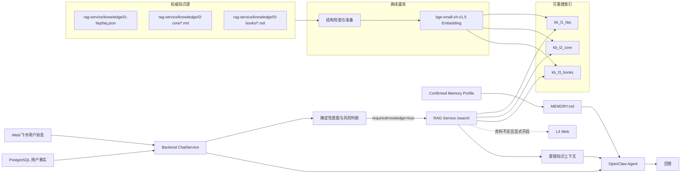
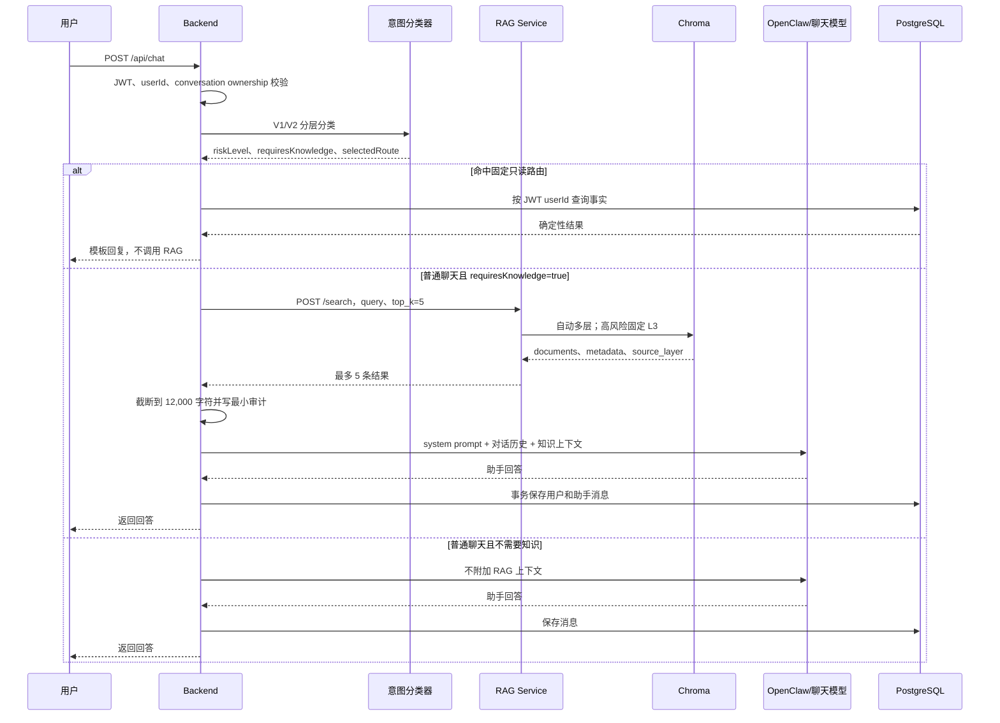

# RightNow 已实现 RAG 完整设计与执行步骤

更新时间：2026-07-13  
适用分支：`local-integration`

本文描述当前已经完成并接入聊天链路的 RAG 方案，而不是未来规划。内容以 Backend、`rag-service` 和生产运行记录为准。知识源、索引、用户事实和 OpenClaw Memory 是四种不同的数据，不能混为一谈。

## 1. 当前结论

RightNow 当前采用“公共知识 RAG + 用户事实上下文 + 稳定偏好投影”的组合方案：

1. 公共健身知识由 L1 FAQ、L2 核心方法、L3 深度资料组成，经 `BAAI/bge-small-zh-v1.5` 向量化后写入三个独立 Chroma collection。
2. Backend 先做确定性意图识别。只有 `requiresKnowledge=true` 的普通聊天才调用 RAG；八条固定只读查询直接读取 PostgreSQL，不调用 RAG。
3. 一般知识请求并行检索 L1/L2/L3。L1 高置信命中时短路返回，否则合并 L1/L2/L3；资料不足且 L4 已开启时才联网搜索。
4. 疼痛、伤病、极端节食等高风险请求固定只查 L3，并由 Backend 无条件附加安全边界。RAG 失败不能移除安全提示。
5. 检索结果最多 5 条、正文合计最多 12,000 字符，只作为受限 system prompt 上下文，不直接写业务数据库。
6. PostgreSQL 是用户计划、饮食、训练、体重、TODO 和稳定偏好的权威来源。公共知识 RAG 不检索用户私有业务事实。
7. OpenClaw Memory provider 当前为 `none`。系统已完成 PostgreSQL Memory Profile 到 `MEMORY.md` 的同步，但不能声称 OpenClaw 向量记忆索引或向量召回已经完成。

## 2. 总体架构



## 3. 数据分层与权威边界

| 层/数据 | 当前载体 | 内容 | 是否用户私有 | 权威来源 |
| --- | --- | --- | --- | --- |
| L1 | `kb_l1_faq` | 高频精炼问答 | 否 | `rag-service/knowledge/l1-faq/faq.json` |
| L2 | `kb_l2_core` | 生活化减脂、基础理论和实战方法 | 否 | `rag-service/knowledge/l2-core/` Markdown |
| L3 | `kb_l3_books` | 营养、特殊人群、伤病与恢复等深度资料 | 否 | `rag-service/knowledge/l3-books/` Markdown |
| L4 | Web Search | 本地三层不足时的外部资料 | 否 | 搜索引擎；当前默认关闭 |
| 业务事实 | PostgreSQL | 计划、TODO、饮食、训练、体重、进展 | 是 | PostgreSQL |
| 稳定偏好 | PostgreSQL Profile | 用户显式确认的长期偏好 | 是 | PostgreSQL |
| Agent 投影 | `MEMORY.md` | 稳定偏好的只读投影 | 是 | 可由 PostgreSQL 重建，不是权威源 |

生产索引目录为 `/var/lib/rightnow/rag/l1`、`l2`、`l3`。索引和模型缓存都不进入 Git；知识源文件才是可审查、可版本化的权威内容。

## 4. 离线灌库执行步骤

### 4.1 准备知识源

- L1 每个 FAQ 必须有唯一 `id`、`question`、`answer`；问题用于向量匹配，答案和标签保存在 metadata。
- L2/L3 使用 UTF-8 Markdown，推荐按 `##` 拆分小节，并保留来源、领域和分类信息。
- 默认字符切块为 `800`，重叠 `200`。
- L2 metadata 包含 `source/domain/category/type`；L3 当前统一以 `nutrition` domain 灌入。

### 4.2 结构检查和非破坏性准备

```powershell
python rag-service/scripts/structure_check.py
python rag-service/scripts/prepare_sources.py `
  --source rag-service/knowledge/l2-core `
  --source rag-service/knowledge/l3-books `
  --output rag-service/.work/prepared
```

`structure_check.py` 检查三层存在性、非空和 L1 ID 唯一性。准备结果写入被 Git 忽略的 `.work`，不修改权威源。

### 4.3 构建全部 Chroma 索引

```powershell
python rag-service/scripts/ingest_all.py --force
```

执行顺序为：

1. 加载 CPU embedding 模型 `BAAI/bge-small-zh-v1.5`，输出归一化向量。
2. `--force` 清空三个目标 collection 的已有 ID。
3. L1 每条 FAQ 作为一个 Document，`question` 是 `page_content`，其余字段写 metadata。
4. L2/L3 Markdown 按 800/200 切块并补充来源 metadata。
5. 分别写入 `kb_l1_faq`、`kb_l2_core` 和 `kb_l3_books`。
6. 输出每层 imported/persisted 数量，重新打开进程后数量必须一致。

生产已记录的持久数量为 L1/L2/L3 `30/16/14`。数量是当次 release 的验收基线，知识更新后应记录新的预期值，不能永久硬编码。

### 4.4 启动服务

```powershell
npm run dev:rag
```

该命令在 `0.0.0.0:8000` 启动 FastAPI。生产由 `rightnow-rag.service` 管理，运行时使用离线 Hugging Face 缓存并设置 `HF_HUB_OFFLINE=1`，避免服务启动依赖公网。

## 5. 在线聊天执行步骤



详细步骤：

1. Backend 从 JWT 获取当前 `userId`，验证 conversation 属于该用户。
2. 意图分类器先执行确定性规则。固定只读查询、业务写入、领域外请求和高风险边界优先处理。
3. 如果产生 `selectedRoute`，直接从 PostgreSQL 返回计划、TODO、饮食、训练、体重或进展，不走 RAG。
4. 如果进入普通聊天，Backend 读取限定长度的当前对话历史，并加入上海当前时间。
5. 仅当 `requiresKnowledge=true` 时调用 `${RAG_SERVICE_URL}/search`，请求 `top_k=5`。
6. 一般请求不指定 collection，RAG 自动检索；高风险请求强制 `collection=l3`。
7. Backend 校验 HTTP 状态、响应结构和高风险 `source_layer`。高风险若不是 L3，按 `RAG_LAYER_MISMATCH` 丢弃结果。
8. 文档正文以 `---` 分隔，合计截断到 12,000 字符，附加“仅根据以下检索资料辅助回答，不要编造来源”。
9. Backend 先确保用户 Agent 存在，再把 PostgreSQL 稳定偏好同步为 `MEMORY.md`，之后调用 OpenClaw Gateway。本地 Demo 可在 Gateway 不可用时使用显式 direct-chat fallback。
10. 回答完成后，用户消息和助手消息在 PostgreSQL 事务中保存。RAG 内容本身不会写入用户业务表或 Memory Profile。

## 6. 自动多层检索算法

默认 `fast_path=true`，执行“L1/L2/L3 并发 + L1 短路”：

1. `t=0` 同时发起 L1、L2、L3 三个检索任务。
2. 最多等待 L1 `150ms`。
3. L1 使用 cosine distance，距离 `<=0.30` 且至少 1 条时立即短路，返回 L1 结果。
4. L1 未命中或超时，则等待已经并发运行的 L2/L3。
5. 合并顺序为 L1 候选、L2、L3；用正文前 120 字符去重，L2 优先于 L3。
6. 合并后仍少于 `top_k`，且 `RAG_USE_WEB_SEARCH=true` 时才调用 L4。
7. 返回 `documents/metadatas/source_layer/fast_path_hit/latency_ms`。

指定 `collection=l1/l2/l3/web` 时只查该层，不执行自动合并。空白 query 在检索前返回 422；未知 collection 返回允许值列表。

当前 reranking 默认关闭。开启后单层先取 `top_k * 3`，再用 cross-encoder 压缩到目标数量，但这不是当前生产默认路径。

## 7. 高风险知识链路

高风险表达由 Backend 确定性分类，不能依赖向量库自行判断安全性：

```text
疼痛/伤病/头晕/极端节食
  -> riskLevel=high
  -> requiresKnowledge=true
  -> POST /search { collection: "l3", top_k: 5 }
  -> 校验 source_layer 必须为 3/l3
  -> 注入 L3 资料
  -> 无条件注入 Backend 安全提示
  -> 回答前再添加停止危险活动的确定性前缀
```

RAG 超时、无结果、返回错误或层不匹配时，系统放弃知识结果，但仍要求回答：停止可能加重不适的活动、不诊断、不提供激进或带伤训练方案，并在持续、严重或恶化时寻求专业医疗评估。

## 8. RAG、用户上下文与 Memory 的关系

公共 RAG 回答“健身知识是什么”；PostgreSQL 回答“这个用户现在是什么状态”。两者不能相互替代。

- `knowledge.search`：查询公共 L1/L2/L3，不带 userId filter，也不应存放用户隐私。
- 八条只读路由：按 JWT userId 直接查询 PostgreSQL，延迟和确定性优先。
- `memory.context.assemble`：按当前 userId 汇总 Profile、onboarding、今日饮食/TODO 和体重趋势，属于用户事实装配，不是 Chroma RAG。
- Memory Profile：只保存经确认的稳定偏好；临时饮食、训练、TODO 和动态体重不得进入。
- `MEMORY.md`：Profile 的确定性投影，供专属 Agent 使用；同步成功不等于向量化索引成功。

因此一次个性化建议理论上可以同时利用公共知识、PostgreSQL 用户事实和稳定偏好，但每一类数据都由 Backend 固定边界决定，模型不能提供表名、路径或伪造 userId 来扩大读取范围。

## 9. 故障降级与安全

| 故障 | 当前行为 |
| --- | --- |
| RAG HTTP 非 2xx | 记录 `RAG_HTTP_<status>`，继续无知识聊天 |
| RAG 响应结构错误 | 记录 `RAG_INVALID_RESPONSE`，丢弃结果 |
| RAG 服务不可达 | 记录 `RAG_UNAVAILABLE`，继续无知识聊天 |
| 高风险返回非 L3 | 记录 `RAG_LAYER_MISMATCH`，丢弃结果但保留安全提示 |
| L1 单层失败 | 返回空候选，继续 L2/L3 |
| L2/L3 单层失败 | 该层视为空，不影响其他层 |
| OpenClaw 不可用 | 生产抛错；本地仅在 `CHAT_DIRECT_FALLBACK=true` 时直连聊天 provider |

`knowledge.search` 审计只保存用户作用域、channel、成功/错误、耗时、目标层、实际来源层和 intent，不保存消息正文、Token 或检索文档。Chroma 索引、模型缓存、用户 workspace 和 `.env` 均禁止提交 Git。

## 10. 验收步骤

### 10.1 健康与持久化

```powershell
Invoke-RestMethod http://127.0.0.1:8000/health
```

必须确认：服务 healthy、embedding 模型正确、L1/L2/L3 enabled、三层 vector_count 非零。重启 RAG 服务后数量应保持一致。

### 10.2 单层检索

```powershell
$body = @{ query = '平台期怎么办'; top_k = 3; collection = 'l1' } | ConvertTo-Json
Invoke-RestMethod -Method Post http://127.0.0.1:8000/search -ContentType application/json -Body $body

$body = @{ query = '外卖怎么吃'; top_k = 3; collection = 'l2' } | ConvertTo-Json
Invoke-RestMethod -Method Post http://127.0.0.1:8000/search -ContentType application/json -Body $body

$body = @{ query = '训练后持续疼痛怎么办'; top_k = 3; collection = 'l3' } | ConvertTo-Json
Invoke-RestMethod -Method Post http://127.0.0.1:8000/search -ContentType application/json -Body $body
```

### 10.3 自动多层与输入校验

```powershell
$body = @{ query = '减脂期怎么安排蛋白质'; top_k = 5 } | ConvertTo-Json
Invoke-RestMethod -Method Post http://127.0.0.1:8000/search -ContentType application/json -Body $body

$body = @{ query = '   '; top_k = 5 } | ConvertTo-Json
Invoke-WebRequest -SkipHttpErrorCheck -Method Post http://127.0.0.1:8000/search -ContentType application/json -Body $body
```

检查自动检索返回不超过 5 条、包含 `source_layer`，空 query 返回 422。

### 10.4 Backend 端到端

使用隔离测试用户验证：

1. “今天吃了多少”命中 PostgreSQL 只读路由，审计中不应出现 `knowledge.search`。
2. “减脂平台期怎么调整”进入普通聊天并产生成功的 `knowledge.search` 审计。
3. “膝盖疼还能继续深蹲吗”必须固定命中 L3，且回复包含停止危险活动和医疗升级边界。
4. 停止 RAG 服务后重复一般建议，聊天应按降级策略继续；高风险安全文本仍必须存在。
5. 审计中不得出现完整用户消息、检索正文、Token 或 Memory 内容。

## 11. 当前已知限制

1. L4 联网搜索代码已存在，但默认 `RAG_USE_WEB_SEARCH=false`，当前生产主链路以本地 L1/L2/L3 为准。
2. OpenClaw Memory provider 为 `none`，尚无 OpenClaw 向量记忆召回证据。
3. L1 的 `answer` 保存在 metadata，但统一检索响应的 `documents` 当前只返回 `page_content`，即 FAQ 的 `question`。Backend 又只把 `documents` 注入生成上下文，因此 L1 快路尚未把结构化答案稳定传给回答模型。这是当前实现缺口，不应在验收中声称 L1 FAQ 答案已完整注入。
4. 合并去重使用正文前 120 字符，不是基于文档 ID 或内容 hash；相似但不完全相同的片段仍可能重复。
5. L2/L3 默认没有统一相似度下限，可能返回相关性较弱的 top-k；reranker 也默认关闭。
6. `source_layer=2` 在 L1 未短路的合并路径中表示主路由层，不代表每条结果都来自 L2；精确来源应查看每条 metadata。

## 12. 关键实现文件

- `backend/src/chat/chat.service.ts`：知识路由、风险强制 L3、上下文截断、审计和降级。
- `backend/src/agent/intent/intent-rules.ts`：`requiresKnowledge` 与风险判断。
- `backend/src/agent/tools/knowledge.tools.ts`：OpenClaw 工具侧 RAG 适配器。
- `backend/src/agent/tools/memory.tools.ts`：PostgreSQL 用户上下文装配。
- `rag-service/main.py`：FastAPI `/search`、导入和 `/health` 边界。
- `rag-service/config.py`：模型、collection、阈值、路径和开关。
- `rag-service/services/fast_multi_layer.py`：并行检索、L1 短路、合并和 L4 兜底。
- `rag-service/services/retriever.py`：Hugging Face embeddings、Chroma 和可选 reranker。
- `rag-service/services/faq_ingest.py`：L1 FAQ 灌库。
- `rag-service/services/ingest.py`：L2/L3 Markdown 切块和 metadata。
- `rag-service/scripts/structure_check.py`：知识源结构检查。
- `rag-service/scripts/prepare_sources.py`：非破坏性准备与去重。
- `rag-service/scripts/ingest_all.py`：三层规范化离线灌库。
